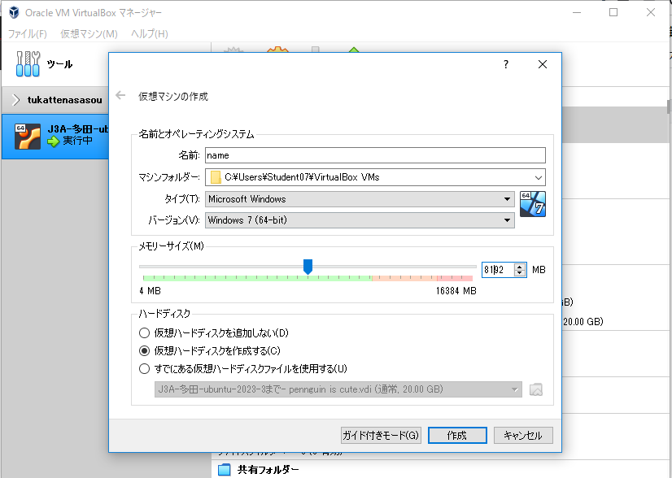

#  第1回 NET分野実習 2022年4月22日

## 画面キャプチャ
`win + shift + s` windows  
`ctrl + PrtSc` ubuntu

 

## VBにubuntuをインストールする
VirtualBox [新規]  
>Ubuntu 64bit  
メモリ 8GB  
HDD 20GB  
VB-起動  
  

**proxyに弾かれる（学校等）**
1. proxyの設定を行う
2. インストール（最小インストールおすすめ）
3. インストール後にproxy設定

**画面を可変にする**  
[VB デバイス] → [Guest Additions…]  → [再起動]

 

## 仮想環境について
* レンタルサーバーなどで使われる  
* OSはハードの違いを吸収し、ソフトを動かす  
→ ハードが変わってもOSが同じならソフトは影響を受けない  

## コンテナについて
* 仮想環境上のハード、OS、ソフトを一つにまとめたもの  
例：Dockers

## VScode
・プログラミングエディタ
・インストールはブラウザから

## メモ
らずぼーん
→ちっさいぱそこん（raspiより性能はいい）
・PCは自動ロックが好ましい
・カフェ等で席を立つ場合はロックすること
・個人情報等をUSBに入れるのはばか

 

## 感想
VBを使ったことはあったが設定の意味を知らなかった。使えるだけでなく意味まで理解する必要があると思った。
