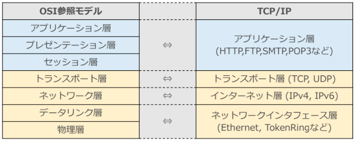

# NET分野実習　2022年4月27日

## IT からICTへ
* IT　情報に関する技術
* ICT 情報通信に関する技術

### ネットワークとは
* ネットワークは仕事のやり取りを行う網状のもの

### コンピューターにおけるネットワーク
* 情報（データ）をやり取り
* 電気信号や電波、光などの通信媒体（メディア）

### プロトコル
* コンピューター同士の「データの形式」や「通信の手順」の約束事
* 低スペックでもプロトコルを守れば通信できる

### RFC
* プロトコルはインターネット上に公開されて誰でも見れる（RFC）
* ネットワークに携わるなら読むべき

 

---

## レイヤー
* 階層構造のこと
* 共通的な機能を下、個別の機能を上に乗せることで、個別の機能が共通的な機能を扱いやすくする

**基本的なレイヤー構造**  
OSI基本参照モデル  

| レイヤー名               | 説明                                   |
| :----------------------- | :------------------------------------- |
| L7　アプリケーション層   | 通信サービス                           |
| L6　プレゼンテーション層 | 表現形式を相互変換する仕組み、書式     |
| L5　セッション層         | 通信開始から終了までの手順を定義       |
| L4　トランスポート層     | 信頼性を向上                           |
| L3　ネットワーク層       | 遠隔地への通信を中継する機器同士の通信 |
| L2　データリンク層       | 直接説ぞ交された機器同士の通信         |
| L1　物理層               | 通信媒体やコネクタの形状など           |

* 役割も覚えよう
* あくまでも理想（モデル）で設計の下敷き

### L1 物理層
* 単位はビット
* 通信媒体上で物理的な接続や接続の維持を行う
* コネクタの形状などを取り決める
* 主に物理学が関わる

### L2 データリンク層
* データの単位はデータフレーム
* 隣同士でのみ通信し、エラー制御を行う
* エラー制御は通信が正しいかチェックする
　例:　010101　→　0の数は偶数　→　頭に0　→　0010101

### L3 ネットワーク層
* データの単位はパケット  
* 階層型アドレッシング  
住所のようなもの（どこに所属している誰か）  
  >例: ２階のCG分野に伝える  
４階探す　→　３階探す　→　２階探す
４階と２階は直接繋がっていないが３階を介すると伝えれる
* 相互通信を行うために論理的なグループで制御し宛先にデータを届ける機能や役割  
  → インターネット

### L4 トランスポート層
* データの単位はセグメント
* パケットが届いたか確認応答する
* ウィンドウ制御、フロー制御
　→　通信の速度やデータ量を変化させて効率をあげる
* エンドツーエンド
　→　通信を行っているアプリけーションの確認

**-—ここまでは通信を安定させる役割--**

### L5 セッション層
* 通信を成立させるために順序を決定  
  （授業の順序や終了の合図のようなもの）

### L6 プレゼンテーション層
* 文字の種類（HTMLだったり）

### L7 アプリケーション層
* アプリケーション層自体
* プログラム本体
* クライアント・サーバーシステム  
（クライアントもサーバーも機器自体の役割ではない）

 

---

## OSI参照モデルに従うメリット
* 各層の分類により、各層での問題点の切り出しが容易  
問題が起きた時  
  >1.プログラムの確認  
2.文字コードの確認 …  
N. ケーブルの確認  
　→ **トップダウン**（上から確認）  
　　**ボトムアップ**（下から確認）  
（エラーメッセージは読み解こう）
* 新しいプロトコルでも同じレイヤー内で差し替えれば他のレイヤーに影響はない
　イメージ: PCのハードを変更してもOSが同じなら問題ない

## ISP
* インターネットへの接続サービスを提供する通信事業者
* インターネットに接続するにはISPへの契約が必要

**イントラネット**
* 自分（企業）の中のネットーワーク
**エクストラネット**
* ２つ以上の季語用が管理
**インターネット**
* 明確な管理者はなく企業や個人も所属
* ただの通信網

インターネットに直接繋がっているわけではない  
→ プロバイダーを経由してつながっている

**専用線**
* ETCやATMで使用
* 一本64Kbpsの電話回線を24本契約  
  →　1536Kbps  
  →　一本切れても問題なく安定性が高い

### TCP/IP
* 実際に使われているプロトコル
* L5 ~ L7 が一体化している（分離は現実的ではない）
* インターネット層はネットワーク層と違う  
　上下と癒着してIPv4とIPv6の変換が大変だったり
* TCPとIPを必ず通る
* TCP/IPはTCPとIPを基盤にしたプロトコル群
* いつまで続くかはわからない。あくまでも現在使っているだけ  
　TCPが QUICK（Googleが開発）にかわる可能性も

 

---

## LANケーブルの作成

### 伝送路の種類
有線  
　電話回線、同軸ケーブル、LANケーブル、光ファイバー  
無線  
　アマチュア無線、地上波、携帯電話

**光ファイバーケーブル**
* 電気ではなく光で通信
* 量子通信では使えないかも

**Ethernet**
* 有線LANの規格
* IEEEE802.3 で標準化

**IEEE**
* あいとりぷるいー

**ツイストペアケーブル**
* 一般的なLANケーブル
* 電線を二本ずつ束ねて撚り合わせたケーブル
* 撚り合わせていない並行状態のケーブルよりノイズに強い  
  →　電磁力が発生し他のケーブルのノイズとなる  
  →　逆位相の電流や波に波をあてて打ち消す

**UTP**
* 撚り合わせただけで別途ノイズ対策はない

**STP**
* さらにノイズ対策のシールドで覆っている
* 病院等の磁力ばんばん環境などでつかう

コネクタの配線規格はA配線とB配線がある

クロスでもストレートでも内部で変換してくれる  
→　現在は速度が遅くなるだけでクロスは意味ない

 

---

## 感想
LANケーブルを作る意味が分からなかったが実際に作ると撚り合わせがを実感したりケーブルの中身がスカスカのもあると知ったり色々な事を知れた。石川先生の薦めるキーボード分解の意味も知りたい

