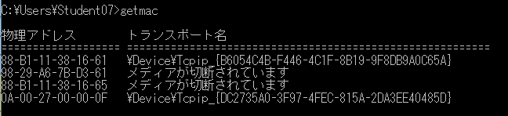
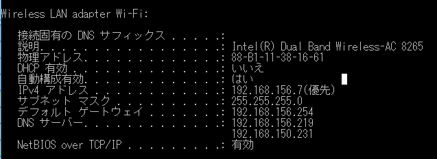
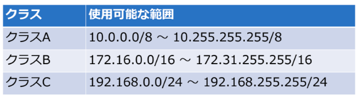
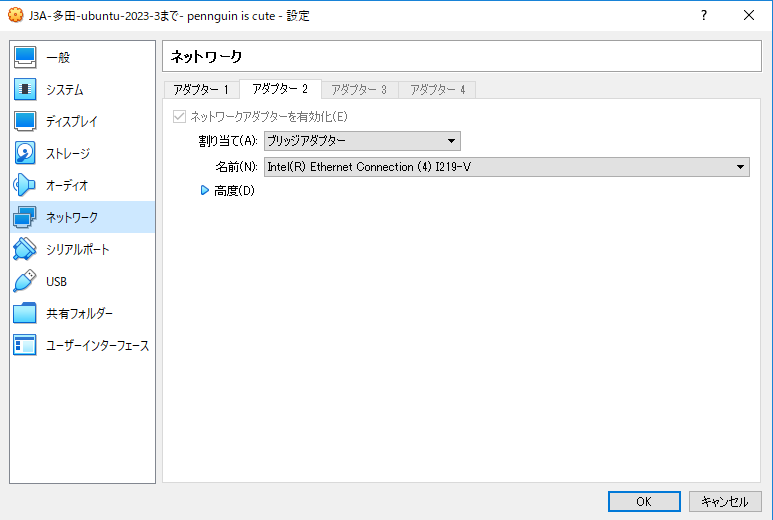
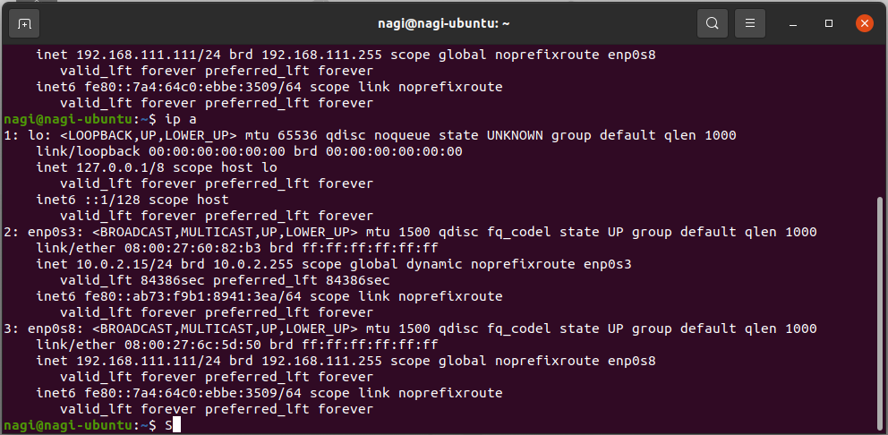
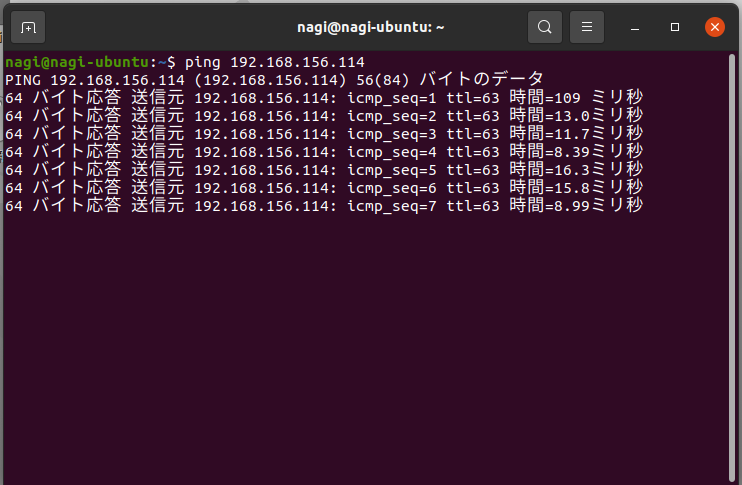
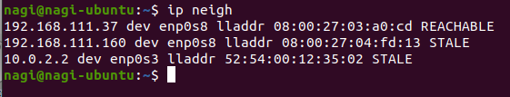

# 第4回 NET分野実習 2022年5月11日

有線LAN → Ethernet
無線LAN → IEEE802.11

* 今回はインターネット層を構築
* 相互接続にはL1 ~ L3まで必要


<br>

## ネットワークインターフェース層
* ハードウェアで直接繋がった機器同士が相互通信  
  L1 のハードウェア  
  > メディア、リピーター、ハブ、リピーターハブ

  L2 のハードウェア  
  > ブリッジ、スイッチ

### レイヤー1
**リピーターの役割**  
　*反双波* に乗せて送る  
　　→ 突然大きく振れたりする  
　　→ 電圧降下により減衰  
　　（山の欠けた部分を補完するような）  
* 現在は小さくおさまっている  

**ハブの役割**
* 足を増やしてる
* 現在ではあまり使われていない
* L2 によって自分宛てのパケットのみ取り込む
　→ 他人のを取り込むとパケットキャプチャとなる
　→ 別のPCでログを残すこともできる（ポートミラーリングを使用？）
* 複数接続した場合同時に通信できない（電話のようなイメージ）
　→ CSMA/CD（”反双”波検知/） によって実現

**CSMA/CD** とは  
1. 反双波を検知して使用中か確認（パケット毎に行う）
2. 使用中ならランダムな時間待機
3. 同時に流した場合衝突した電圧（ポリジョン）を検出する
　→お互いランダムな時間待機し再送する  

すべてのポートで行う  
ポリジョンドメインはL2のスイッチによって分断

L1 はあくまでも電気的な接続


<br>

### レイヤー2
* Macアドレスで誰宛てか判断
* 原則変えられない
* 他の機器の偽装を行うこともできる  
  
Macアドレスの確認方法  
```getmac```  
  
``ipconfig /all``  


**IEEE 802.3**  
Ethernet
* LANケーブルで電気的な接続
* パッケージに書かれた速度に近い
**IEEE 802.11**  
Wireless LAN
* 無線通信で用いる
* 電波の届く範囲がポリジョンドメイン
　→ 通信が遅くなる
**IEEE 802.15.1**  
Bluetooth

**Macアドレス**
* 48bitの整数値で表現
* 人が見やすいように8bitずつで表現
* 先頭24bit : ベンダーID　メーカーごとに割り振る  
  後半24bit : 識別ID　メーカーが決定する
* 同じ空間で重複すると接続できない

L3 以上ではIPアドレスを用い、Macアドレスを関連づける

<br>

## IPv4 アドレス
* 32bit の整数値で表される
* IPv4アドレスはネットワーク部とホスト部で分けられる
* 同じネットワーク内で重複してはいけない
* インターネットに公開される機器のIPアドレスは重複してはいけない

**プライベートアドレス**  
LAN内のアドレス
>192.168.xxx.xxx  

**グローバルアドレス**  
インターネット上のアドレス

* プライベートとグローバルを繋ぐ仕組み  
→ NAT（一般家庭はルーターが担っている）
* プライベートとグローバルで使える範囲が”原則”決まっている



**サブネットマスク**  
```
192.168.0.0/24 → の ”24”  
24を二進数に変換して頭から1の数がネットワーク部  

192.168.0.15/24  
 → 11000000.10101000. 00000000.00001111 （IPアドレス）  
 → 11111111  .11111111.   11111111   00000000（サブネットマスク）  
  論理和  
 → 11000000.10101000. 00000000.00000000  
```

<br>

## ネットワーク構築

* ネットワークアダプターを追加（有線）  



> ip addres　(ip a)

```
　“ 1 “  ブリッジ
　　inet : IPv4　inet6 : IPv6　のIPアドレス
　　→ NATを使用せず直接アクセス

　“ 2  “ NAT
　　NATを介して外部と接続している

　“ 3 “
　　windows の場合、他の端末と自動で接続？
```


今回はあくまでもLAN内

IPアドレスを決める  
`192.168.xxx.zzz`  
　xxx は LAN（グループ）内共通　今回 “ 111 ”  
　zzz は LAN（グループ）内固有　今回 “ 111 ”  
　→ 192.168.111.111

> ip a
```
　” 3 “
　　設定したIPアドレスが追加される
```
> ping [ IPアドレス ]

接続の確認ができる


<br>

### ARP とは 
　MacアドレスとIPアドレスを関連づけて記憶  
> arp -a  
> ip neigh  



Macアドレスブロートキャスト  
→ 繋がっている全てのPCに送信し返ってくることで接続確立

<br>

### スイッチングハブ の特徴 
* 最初の接続でMacアドレスとポートを記録
* その後の接続は要求先のみに流す  
  → 衝突しづらい
* ホームルーターはスイッチングハブとルーターを組み合わせたもの
* CISCO ルーターは設定大変だけど柔軟

<br>

## メモ 
ラズパイとVNC、SSH接続したい  
→ Windowsは管理者権限なく不可  
→ 仮想環境なら可能

pip を使いたい  
→ プロキシのせいで出来ない  
→ 仮想環境なら可能  

<br>

## 感想 
部室のネットワークはよくわからなかったので後輩に託していたが、今回実際にやったことで羽生の役割等がよく分かった。また arpコマンド をよく使っていたが接続したばかりでは表示されないことが多く使い勝手が悪いと思っていた。しかしこのコマンドの役割を知って使い方が間違っていたことがわかった。
