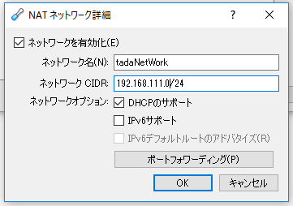
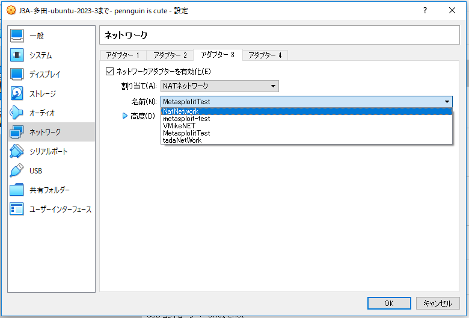
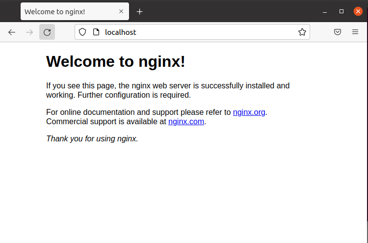
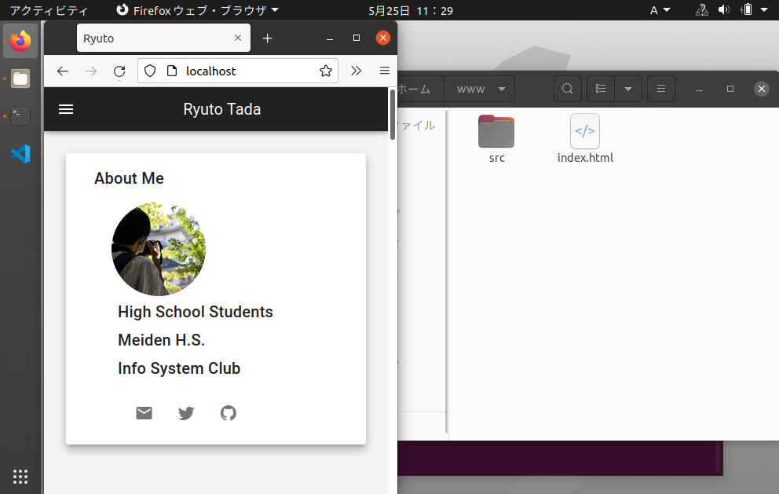

# 第4回 NET分野実習　2022年5月25日

## Xubuntu
* ubuntuのデスクトップ軽量版
* ubuntuを複数台起動するにはメモリが足りないため使用
* GUIが必要なら最低1GB、不要ならさらに減らせるがwebサーバー等は潤沢に

 

## 仮想環境構築

0. 仮想環境 インポート  
   できなければ ”ガイド付きモード” で実行
1. ネットワーク生成  
   [環境設定] → [ネットワーク]  
   
   
2. それぞれのPCにネットワークを設定  
   （LANケーブルを接続するような感じ）
3. 起動後 ping で接続確認

 

##  webサーバー構築 Nginx 
> sudo apt update

セキュリティのために最新にする必要がある
> sudo apt install nginx

Nginx をインストール
> sudo service nginx start

Nginx を起動（localhost で見れれば完了: 写真）

> sudo upgrade-rc.d nginx defaults

起動後に自動起動させる

 

html ファイル等を置くと表示される

 

##  webサーバー
* **Apache** と **Nginx**（エンジンエックス） などがある
* 現在はNginx が逆転
* HTTPクライアント（ブラウザー）からの問い合わせに対して返す
* WWW（WorldWideWeb）  
　→ webの略でHTMLをネットワーク経由で閲覧可能にする  
　　 WWW は仕組みのこと。インターネットは通信手段
* HTML の仕様は Living Standard が決定している  
　（ブラウザのシェアが大きいGoogleが大きい）
* WebページはHTMLだけではない  
　→ CSS, JavaScript（ECMAscript）

 

##  HTTP 
* HTTP version3 は UDP をベースとした Quick を使用してる
* HTTPの通信は２種類
　→ HTTPリクエスト、HTTPレスポンス
　　（現在はWebだけでなくアプリの通信でも使用される）
* HTTP の中身はテキストデータなのでプログラムが組みやすかったり
* HTTPは接続を維持しない
　→ 状態の維持にはCoolieなどを使用

 

## メモ
###  パイプ処理* grepコマンド 
ターミナルにて
    “ | ” は左のコマンドの結果を右に渡す
    “ grep ” 指定した文字を含む行のみ出力

 

##  感想 
kaliで遊んでいた時、metasploitに対してぺテストレーションをしてみようとしたが、ネットワークがうまく接続されず出来なかった。今回教わりながらやって見るととても簡単だと分かった。webサーバーはApache,Nginx,Node.jsを触った事があり、とてもスムーズにできたと思う。次回、写真の回転以外は。なぜ出来なかったのか確認する。
