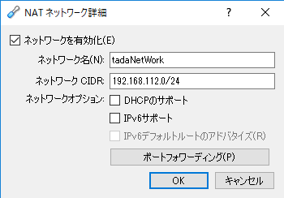
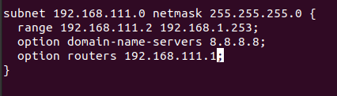
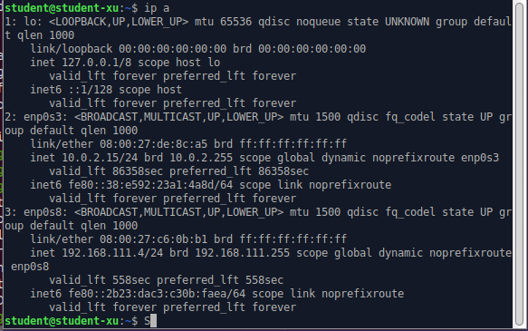
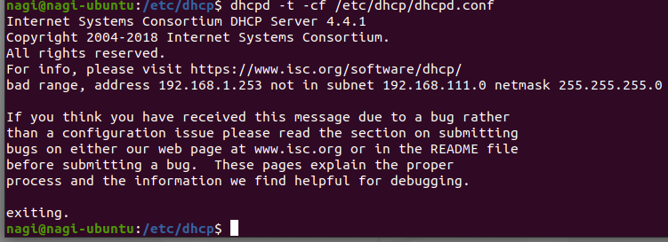

# 第6回 NET分野実習 2022年6月1日

## DHCPサーバー
* IPアドレスを割り振る
* 基本的にはDHCPサーバーが設定してくれる
* レイヤー２で設定している
* 基本はWiFiルーターに内蔵している
* Linuxで構築すると細かく設定できる
* WiFiルーターの設定が必要ないのは接続した時点でネット側から流れてくるから  

**DHCPディスカバー**  
クライアントがDHCPサーバーがあるか全てのコンピューターに送信

**DHCPオファー**  
サーバーがDHCPサーバーから返信
**DHCPリクエスト**  
クライアントがオファーを受けることを全て
**DHCP肯定応答**  
サーバーから設定情報を送信

* MacアドレスとIPアドレスの関連づけする期間を設定できる  
　→ 一定時間後に接続されていなければ削除  
　→ 効率よく運用可能
* ネットワーク上にDHCPサーバーがあれば使用可能
* DHCPは基本一般ユーザー向け
* 不特定多数と接続する場合はDHCPが有用
* 社内など固定の場合は手動の方がセキュリティ上良い
* DHCPだとスイッチに勝手に繋いでも使用できる

<br>

## サーバーアプリケーション
* SSHはOpenSSHなど  
　ssh → 画面（GUI）を必要としない
* ファイル共有はsmbプロトコルを使用
* メールサーバーもある  
　会社に依存していいなくリスク（障害・倒産等）に強い

<br>

##  DHCPサーバー構築 
* VBのネットワークで「DHCPのサポート」を切る  


（今回は isc-dhcp-server を使用する）  
IPアドレス  
　192.168.xxx.0  
　　→ ルーター固定（デフォルトゲートウェイ）  
　192.168.xxx.2 ~ .4  
　　→ 大体空（DHCP用）  

1. インストール  
   > sudo apt install isc-dhcp-server
2. /etc/dhcp/dhcpd.config を編集  
   ```
   subnet - アドレスを指定（192.168.xxx.0）
   netmask - そのまま（255.255.255.0 今回は）
   range - IPアドレスを割り振る範囲を指定
   （192.168.xxx.2 ~ xxx.253 今回は）
   option domain-name-servers - DNSサーバーを指定
   （8.8.8.8 Googleを使用）
   ```
   
3. isc-dhcp-server を再起動  
   > /etc/init.d/isc-dhcp-server restart
4. 確認  
   ```
   Xubuntu で確認... できてない！（画像）
   → Xubuntu 再起動...できない！
   → 設定確認（DHCPを使用→OK）
   → DHCPサーバーの問題？
   ```
   
5. 追記  
   ```
   authoritative;　コメントアウト削除
   ```
6. isc-dhcp-server を再起動  
   > systemctl restart isc-dhcp-server  
   
   別の再起動方法
7. 確認  
   だめだった
8. デバッグ
   > dhcpd -t -cf /etc/dhcp/dhcpd.conf
   
     

   （2 の range がおかしいよ！）  
   192.168.1.253 → 192.168.111.253 に修正
9. 確認  
　成功！  
　Xubuntu に 192.168.111.4 が割り振られている


**参考**  
  [インフラエンジニアになりたくて](https://engineer-ninaritai.com/iscdhcpserver-config/)  
  [Server World](https://www.server-world.info/query?os=Ubuntu_20.04&p=dhcp&f=1)    

<br>

##  メモ 
> clear  

ターミナルの履歴をけす（便利）  

**パブリックDNS**  
Google Public DNS  
　8.8.8.8  , 8.8.4.4

<br>

##  感想 
DHCPはWiFiルーターにあるのでwebサーバーと違い、わざわざ構築するという考えはなかったが、DHCP”サーバー”なので構築するものだと思った。
通信するにはIPアドレスがなければいけないと思ったが、DHCPサーバーからIPを割り振ってもらうにはIPのない状態で通信する必要があるのでどうなっているのかまだ理解できてないため、今後調べていきたい。
