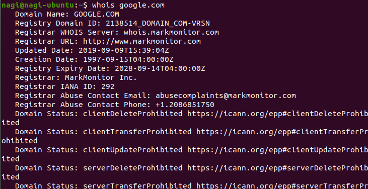
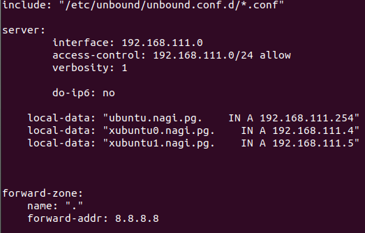
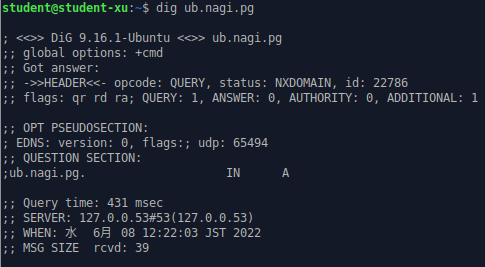

# 第6回 NET分野実習 2022年6月8日


**HTTP/3**
* HTTPがRFCで標準化
* UDPベースのQUICを使用している  
[Publickey](https://www.publickey1.jp/blog/22/ietfhttp3rfc_9114.html)

**DNS**
* Domain Name Systemの略でサーバーではない
* DHCPとは違い、一台では完結しない
* ドメインとIPアドレスを紐づけて提供してくれる
* コンピューター名（ホスト名）ドメイン名はにているもの
* DNSはネームサーバーとフルリゾルバに分かれる

**ネームサーバー**
* 電話帳のような役割
* ドメイン名とIPアドレスを紐づけて登録

**フルリゾルバ**
* ネームサーバーに問い合わせを行い、IPアドレスを教えてくれる
* 一定時間情報を保持し、ネームサーバーの負荷を軽減する
* 集中管理ではなく、管理権限の分散を行っている  
→ それぞれのネームサーバーが管理する領域をゾーンと呼ぶ  
　ゾーンを分割して他のネームサーバーに任せることを委任と呼ぶ  
* トップから順に探す
* 権威サーバーは世界で多くない  
→ ないとドメインでは繋がらなくなるが、IPを直接指定すればある程度使える
* hosts ファイルが最重要  
→ 書き換えられると接続先が変えられる

**リソースレコード**
* Aレコード
　ドメイン名に紐づくIPアドレス
* その他、NS,MX,TXT,SOA,CNAME などがある

**オープンリゾルバ**
* GoogleやCloudflareなどが提供するリゾルバ
* 名前解決が遅い場合は切り替えると良いかも

**Bonjour**
* (ホスト名).local ドメインをLAN内で使用できる  
（インターネット上ではドメイン名を使用）

**ドメイン**
* IPアドレス（数字の羅列）と意味のある名前を関連づける
* ドメインは後ろ（トップレベルドメイン）から見られる
* 自分で借りれるのはセカンドレベルドメイン
* サードレベルドメインはSLDの所有者が決定できる
* どの会社でも品質は同じだがレジストラとリセラによって異なる  
　→ レジストラの方が規模が大きく、倒産しづらい  
（”Google Domains”等）

**FQDN**
* 完全修飾ドメインと呼び、HTTPのURLはこれを使用
  
> whois
* ドメインの所有者情報等を表示してくれる  
  （サイトもある）  
  

> nslookup
> dig
* DNSサーバーに名前解決を問い合わせる

<br>

##  DNSサーバー構築
* Unbound を使用する
* 今回は内向きの環境

1. Unbound をインストールする
   > sudo apt install unbound

2. /etc/unbound/unbound.conf.d/unbound.conf を編集
   

3. unbound 再起動
   > sudo service unbound restart  
   > sudo systemctl enable unbound  
　エラー

4. /etc/unbound/unbound.conf を編集

5. 再起動
   > sudo systemctl restart unbound  
   
   → エラー

6. (2)を元に戻して再起動
   >sudo systemctl restart unbound  
   → 成功？

7. 確認
   > dig xubuntu.nagi.pg  
   
   → エラー  
   

8. (4)を一部変更
interface: 192.168.111.0 → interface: 127.0.0.1

9. 確認  
    (ubuntu) 
    > ping xubuntu0.nagi.pg  

    → 成功  
    (xubuntu)  
    > ping ubuntu.nagi.pg  

    → 失敗　ローカルのみに制限したから？  

10. (8) 同様  
0.0.0.0　→　xubuntuのみ失敗 

11. /etc/unbound/unbound.conf 見た
    ```
    include:” /etc/unbound/unbound.conf.d/*.conf”
    ```
    このファイルは下のファイルを読み込んでいるから最初のファイルに書く方がよさそう
    
    (ここら辺でubuntuのsystemd-resolveを停止させた)

12. エラー確認
    > unbound-check  
    
    → エラーなし

13. xubuntu のネットワーク設定  
    DNSサーバーにubuntuのIPアドレスを追加してみた

14. 結果  
    ubuntu内ではできたがxubuntuからは出来なった

<br>

##  参考
[gihyo.jp](https://gihyo.jp/admin/serial/01/ubuntu-recipe/0386)  
[web net FORCE](https://webnetforce.net/unbound-dns-server/)  
[Citizen of undefined](https://yryr.me/linux/ubuntu-20-04-1-lts/install-unbound-as-dns-server-and-setting.html)  
[Qiita](https://qiita.com/umaxiaotian/items/b7f8f4866468d5c400b3)  
[純規の暇人趣味ブログ](https://jyn.jp/unbound-internal-dns/#i-2)  

<br>

##  メモ
カーソルが取られた場合
→右Ctrl

### 授業後に考えたこと
systemd-resolveの停止と(14)をXubuntuでもやるべき？

<br>

##  感想
色々調べつつ試してみたが、調べても欲しい情報が出てこなく、授業時間では出来なかった。検索能力やネットワークに関する語彙力不足が主な原因だが、既にある情報から自分なりに柔軟に対応する能力も足りてないと思った。
