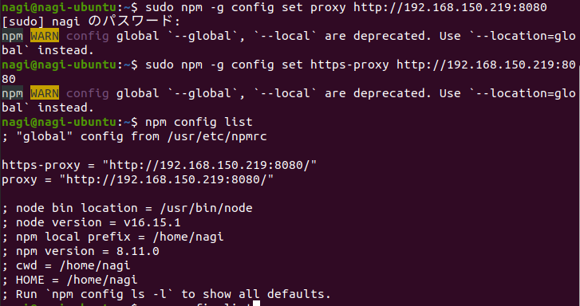
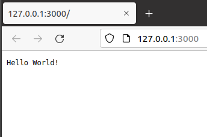

# 第8回 NET分野実習　2022年6月22日

## 6/21 システム障害
* CloudFlare のサーバーにて障害  
* Discord, pixcive 等の様々なサービスが使用している  
* CDNの提供もしている  
  → 一社が落ちると大きな影響  
* UXデザイン  
  アプリの使いやすさ  
  障害が発生することを前提に動かなければならない  
* インターネットは分散するべき  
  → 障害発生時に大規模障害を回避  

[Cloudflare outage on June 21, 2022](https://blog-cloudflare-com.translate.goog/cloudflare-outage-on-june-21-2022/?_x_tr_sl=en&_x_tr_tl=ja&_x_tr_hl=ja&_x_tr_pto=sc)

<br>

## webアセンブリ
* 統一規格がある（WASM）  
* Rust 言語を使用  
  C言語、C++のようなルールベースで固い言語
* JavaScriptの代用（？）

<br>

## サーバー側 JavaScript
Node.jsは大体のPCで動く

npmプロキシの設定
> sudo npm -g config set proxy http://192.168.150.219:8080  
> sudo npm -g config set https-proxy http://192.168.150.219:8080  
> npm config list  
```bash
; "global" config from /usr/etc/npmrc
　
https-proxy = "http://192.168.150.219:8080/" 
proxy = "http://192.168.150.219:8080/" 

; node bin location = /usr/bin/node
; node version = v16.15.1
; npm local prefix = /home/nagi
; npm version = 8.11.0
; cwd = /home/nagi
; HOME = /home/nagi
; Run `npm config ls -l` to show all defaults.
```
このプロキシの設定方法は古く ’WARN’ がでる  


（前に追記されてるのがきになる）  
（コマンドの実行順　`proxy` → `https-proxy`）

npm → Node Package Manager の略  
Nodeバージョン管理
* Nodeを複数バージョン入れておき、切り替えて使える  
　Mac → `nodebrew`  
　debian系 → `n`

Webサーバー構築  
```JavaScript
[webserver.js]

const http = require('http');
const hostname = '127.0.0.1';
const port = 3000;
const server = http.createServer((req, res) => {
    res.statusCode = 200;
    res.setHeader('Content-Type', 'text/plain');
    res.end('Hello World!\n');
});

server.listen(port, hostname, () => {
    console.log(`Server running at http://${hostname}:${port}/`);
});
```


<br>

**telnet からの通信**
> telnet localhost 3000  
> GET / HTTP/1.1
```
HTTP/1.1 200 OK
Content-Type: text/plain
Date: Wed, 22 Jun 2022 02:02:32 GMT
Connection: keep-alive
Keep-Alive: timeout=5
Content-Length: 13

Hello World!
```

<br>

**Socket通信**
```JavaScript
[hello-server.js]

const net = require('net');

const server = net.createServer((socket) => {
    console.log('クライアント接続 - from ' + socket.remoteAddress + ':' + socket.remotePort);
    socket.on('close', () => {  // 通信終了したら実行する関数
    console.log('通信終了 - from ' + socket.remoteAddress + ':' + socket.remotePort);
    });
    
    // クライアントにデータ送信
    socket.write('Hello World!\r\n');
    // クライアント切断
    socket.pipe(socket);
}).listen(3000); // 通信待ち受けポート

console.log('localhostの3000番ポートでサーバー起動しています。');
```
<br>

サーバー側
> node hello-server.js
```
クライアント接続 - from ::ffff:127.0.0.1:43198
通信終了 - from ::ffff:127.0.0.1:43198
```
クライアント側
> telnet localhost 3000
```
Trying 127.0.0.1...
Connected to localhost.
Escape character is '^]'.
Hello World!
^]
telnet> q
Connection closed.
```

<br>

**Socket通信（クライアント受信）**  
サーバー側
```JavaScript
[hello-server.js]
```
クライアント側
```JavaScript
[tcp-client.js]

const net = require('net');

const client = net.connect('3000', 'localhost', () => { // 接続先を指定
  console.log('サーバーに接続しました。');
  // client.write('Hello, Server!!'); // サーバーにデータを送信する場合はwriteしましょう。
});

client.on('data', data => {
    console.log('サーバーからデータ受信: ' + data);
    client.destroy();  // クライアントを破棄します。
});

client.on('close', () => {
  console.log('サーバーから切断しました。');
});
```

<br>

**Socket通信（クライアント送信）**  
サーバー側
```JavaScript
const net = require('net');

const server = net.createServer((socket) => {
  console.log('クライアント接続 - from ' + socket.remoteAddress + ':' + socket.remotePort);

  socket.on('close', () => {  // 通信終了したら実行する関数
      console.log('通信終了 - from ' + socket.remoteAddress + ':' + socket.remotePort);
  });

  socket.on('data', (data) => {  // dataにはクライアントからのデータ入ってきます。(※中身のデータをよく確認しましょう)
    console.log('クライアントからのデータ: ' + data + ' from ' + socket.remoteAddress + ':' + socket.remotePort);

    socket.write(data);  // 受け取ったデータをそのまま返す
  });

}).listen(3000);

console.log('localhostの3000番ポートでサーバー起動しています。');
```

クライアント側
> nc localhost 3000  
> こんにちは

サーバー側
> クライアントからのデータ: こんにちは

<br>

**ソケット通信**
* 電球のソケットが由来
* IPとポート番号があれば通信できる
* 他はソケットが担ってくれる
* 基本的にはTCP通信

**HTTP通信**
* 流行った原因は通信内容がテキストだから
```
[HTTPリクエスト]

GET ##   HTTP/1.1
```
```
[HTTPレスポンス]

HTTP/1.1 200 OK
HEADER

<!DOCTYPE html>
...
</html>
```

<br>

## 課題
**プロトコル**  
1.挨拶君
```
「やあ」  
→時間に合わせて挨拶  
（「おはよう」「こんにちは」「こんばんは」）  
「何時？」  
→「今は {datetime} だよ」  
「帰りたい」  
→「帰れ」or「頑張って！」  
```

<br>

2.法則ゲーム
* ランダムな法則性のある数列の[n]番目を当てる
* 正解すると[?]がでてからの時間が返されrう
* 間違っていると「It's not 8」と出る
```
> start
1 3 5 [?] 9 11 13 ...
> 7
CORRECT!!
TIME: 3.14s

> start
3 4 6 9 13 [?] 24 31 39 48 58 ...
> 8
It's not '8'
> 9
CORRECT!!
TIME: 14.18s
```

[リポジトリ](https://github.com/satooru65536/practice/node/)

<br>

## メモ
- [ ] コンピュータープログラムはどのように動いているか  
- [ ] Wizard Bible事件  
- [x] アラートループ事件  
- [x] 中国語の部屋  
* 使用する言語は場合に応じて使い分けること  
* 様々な言語と触れ合うこと  
* おすすめ言語 Rust, Haskell, Java, Python, Ruby, Erlang  
Haskell　関数型プログラミング言語  
Erlang　ネットワーク用の言語（任天堂大乱闘などで使用)
* HTTP1.0をSocketで作ってみる  
* nc == telnet  
　nc(net cat)がより良い

<br>

## 感想
通信内容を見るには**Wireguard**などで通信を確認する必要があると思っていいたが、HTTP通信は`telnet`や`nc`で確認できることを知った。通信内容が思ったより簡単で分かりやすく驚いた。
node.jsを使うときは`node_modules`が必須だと思っていたがなくても簡単な部分は動くことを知った。`node_modules`中で実際に処理（？）されている訳ではないとわかった。よく考えたら当たり前かもしれない。
