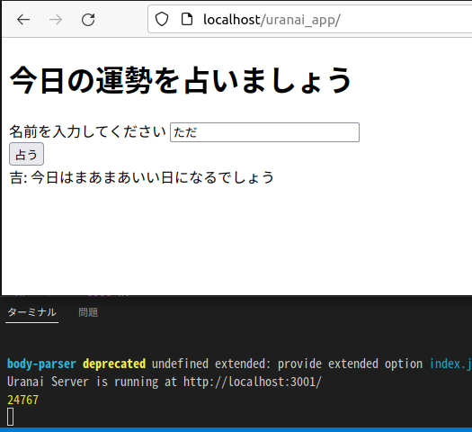
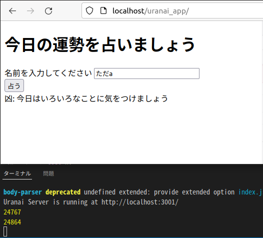
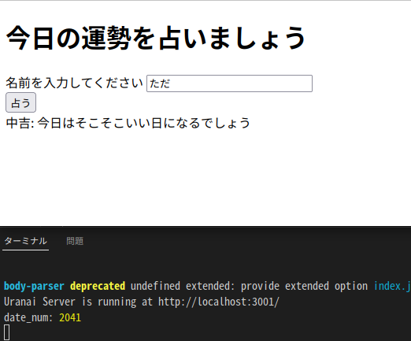
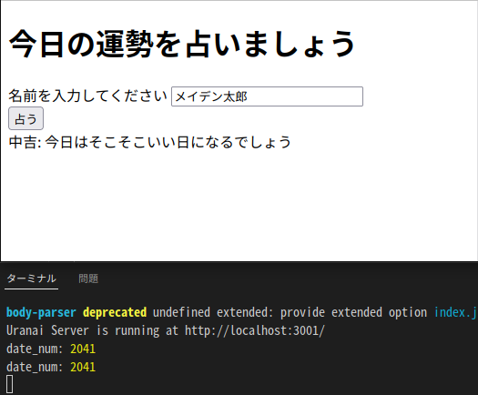
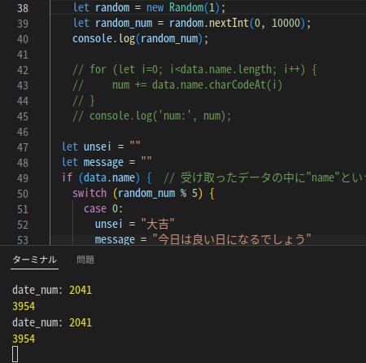
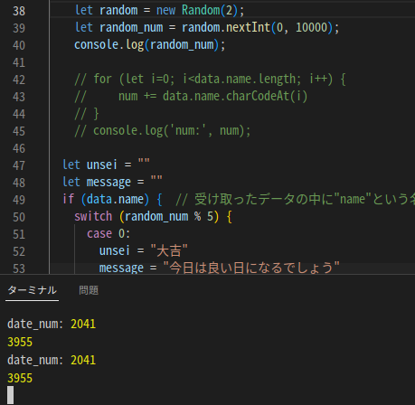
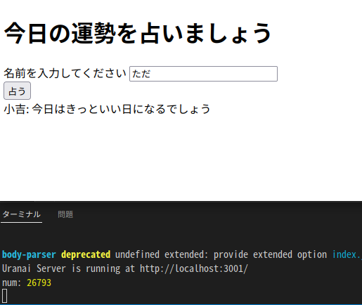
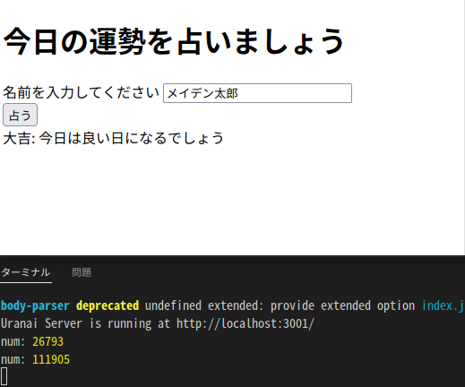

# 第8回 NET分野実習　2022年7月13日, 14日

## ポートフォワーティング
* ポートを公開することで外部からアクセスできるようになる

## うらないアプリ
* 名前の文字数から占うのは面白くない  
-> 文字コードを足した数値で占う
```JavaScript
for (let i=0; i<data.name.length; i++) {
    num += data.name.charCodeAt(i)
}
```




* 毎日同じ結果は面白くない
-> 日付を数値化して占う数値に足す
```JavaScript
    const dt = new Date();
    const date_num = Number(dt.getFullYear()) + Number(dt.getMonth()) + Number(dt.getDate())
```




* 上記２つを足した値を割るだけでは周期的に変化してしまう  
（翌日は前日+1 の値となるため）  
-> 日付をシード値とした乱数を足す




<br>

完成!





## オリジナルアプリ
[挨拶くん](../2022-06-15/memo.md) をつくる


###  メモ
* **おすすめ書籍**  
プロフェッショナルIPv6
* 図書館を活用しよう

### 参考
[シード値から乱数を生成](http://dotnsf.blog.jp/archives/1080312090.html)