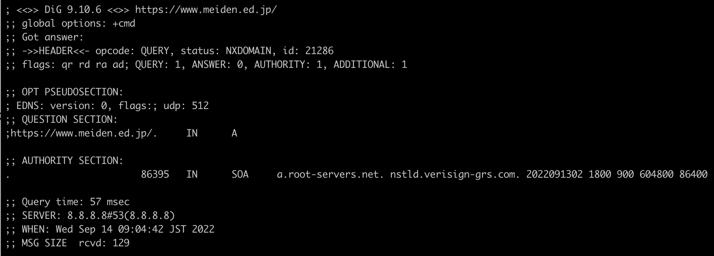

# 第11回 NET分野実習　2022年9月14日

## COCOA
* 失敗, 完璧を恐れずに公開しよう
* `COCOA` のアプリは **[GitHub (cocoa-mhlw/cocoa)](https://github.com/cocoa-mhlw/cocoa)** で公開されている
* `COCOA` は停止するプロセスも書いてあるから見てみよう
* アプリは停止の対応も必要な場合もある
* アプリのログを見ることもできる  
  => [COCOOA のログの分析サイト](https://cocoalog.jp/)
* うまくいかなかったことも成功
* 制作したアプリもじゃんじゃん公開しよう!

## 名電サイト
* 現在名電のサイトに繋がらない

原因の探し方
* サイト開く
    ```
    DNS_PROBE_FINISHED_NXDOMAIN
    ```
    これ原因

* digコマンド実行 `dig https://www.meiden.ed.jp/`  
    

* 直接IPアドレスを打ち込んでみたり...
* 学内のLAN内から直接IPアドレスを打ち込んでみたり...

```
Aレコードが見れない  
=> DNSの設定がおかしい
=> DNSサーバーの設定を確認しよう(管理者なら)
```

## 無線通信
* 花火回析のいい例
  * 音はするけど光は見えない
  * 発生源は同じ
  * 音は波長が長く回折しやすいが、光は短く直進性が高い

* 安いホームルーターはハブが4本しかなく遅い
  * 最大でも `100mbps`
* WAN側が早くてもLAN側が遅ければ意味がない
* ホームルーターは指向性のアンテナが両側についているイメージ
* `Buffalo` はコスパが高め(買いやすいだけ)
* `ASUS` が性能が高いものを売っている
* 国産ならおすすめは `NEC`
* 海外なら `NETGEAR`
* 品質と性能は大体は比例する

### 実践
#### LAN設定
* Ubuntu のネットワークに `ブリッジアダプター` を追加
* DHCP を 自動
* DNS を 自動
* Ubuntu を再起動する
* ルーターが `192.168.11.1`, WAN側PCが `192.168.11.2`

#### ルーター設定
* 5Ghz帯が変更しやすい
* SSIDは変更しよう(機種から脆弱性を探しやすくなる)
* SSIDが表示される状態はLANケーブルを繋げられる状態とほぼ同じ

#### SSID
* どこと通信しているかを識別するためのID
* 大文字小文字を区別する
* 最大32文字の英数文字列

#### アドホックモード
* APを無しに通信できる
* クライアント同士が `P2Pネットワーク` 内で接続される

#### インフラストラクチャネル
* 帯域を複数に分けて通信される
* 2.4GHz帯の幅は 80MHz なのに13チャネルある
  * 隣同士のチャネルでかぶさる
  * かぶさった部分では輻輳状態になりやすい
* 2.4GHz帯は混雑しやすく、最大でも4チャネルしか通信できない
  * => 無理がある
* 5GHz, 6GHz帯が出てきた
* 5GHz帯は144チャネル使える(2.4GHz帯よりも圧倒的)
  * たくさんの機器で同時に通信できる
  * 一台で4チャネル使用したりできる  
    (**マルチチャネル**)
* 6GHz帯が許可された
  * 6E対応ルーターなら使用可能

#### 無線LANでの信号衝突回避
**CSMA/CA**
* 無線の場合、そもそもぶつからないようにする
* 使用するチャネルをあらかじめ予約する
* 予約されている間は他の機器は通信できない
* 有線の方が早いのは仕組み上の問題が大きい

#### 無線LAN と WiFi の違い
**無線LAN**
* 無線技術で作られる LAN

**WiFi**  
* `802.11規格` に完全準拠しているか
* 実はホームルータは WiFiロゴ が付いてなかったり...
* ただし付いていなくても、準拠していて使用可能のものもある

#### 無線LANのセキュリティ
**前提**
* 無線LANは傍受される  
  => 傍受されるのを前提に通信する必要がある
* 簡易性・ 利便性
  * エリア内であればだれでも簡単に接続できる
  * SSID は無線圏内に入れば容易に知ることができる
* 誰でもネットワークに接続でき、傍受できる

**攻撃**
* 歩きながらSSIDを探し、記録する  
  (**ウォー・ドライビング**)
* 認証がなければすでに完了
* 脆弱性のある暗号方式の場合、数分で簡単にクラッキング  
  (WEPとか...)
* 有名カフェ等の同じSSIDと同じパスワードにすると勝手に接続できる
* プロキシを設定すると暗号化していても簡単に抜ける
* 外に漏れてはいけない場合等は、外のWiFiに接続しないようにしよう

**対処**
* 暗号化は必須(傍受を前提)
* SSIDをブロードキャストしない設定をする(確実ではない)  
  (**SSIDを隠蔽**)
* MACアドレス等で接続できる端末を指定する  
  (**アクセス制限**)
* 信頼できる人にだけアクセスさせる  
  (**認証機能**)

**認証の方式**
* **オープン認証**-認証なし
* **WEPによる認証**-WEPキー(WEPはオワコン)
* **WEB認証**-ユーザーID/パスワード
* **EAP(IEEE802.1X 認証)**-ユーザーID/パスワード

#### ユーザー側の対策
* 危険が伴うことを理解した上で使用する
* セキュリティ機能が用意されていないされていない無線APに接続しない
* PC側のセキュリティ機能をオフにしない
* ユーザー側はこれ以上なにもできない


ルーターはたまにキャッシュやログを消してあげると良い

<br>

## メモ
* サイトが落ちていたら遊んでみよう！
* 言語のファイアーウォールは退治
* EAP(IEEE802.1X 認証)きになる

<br>

## 感想
FreeWiFiは危険だというのは分かっていたが、実際の方法を聞くと、より簡単さが理解できて利用方法を改めようと思った。
家のWiFiのセキュリティは基本的に初期のままで、機会があれば本気のセキュリティを掛けてみたいと思う。
また、家のWiFiは自分の部屋では0~2本しか立っていなく、繋がりが悪かったがログを削除したり再起動をしてみたところ3本以上立ち、有効性を実感できた。
