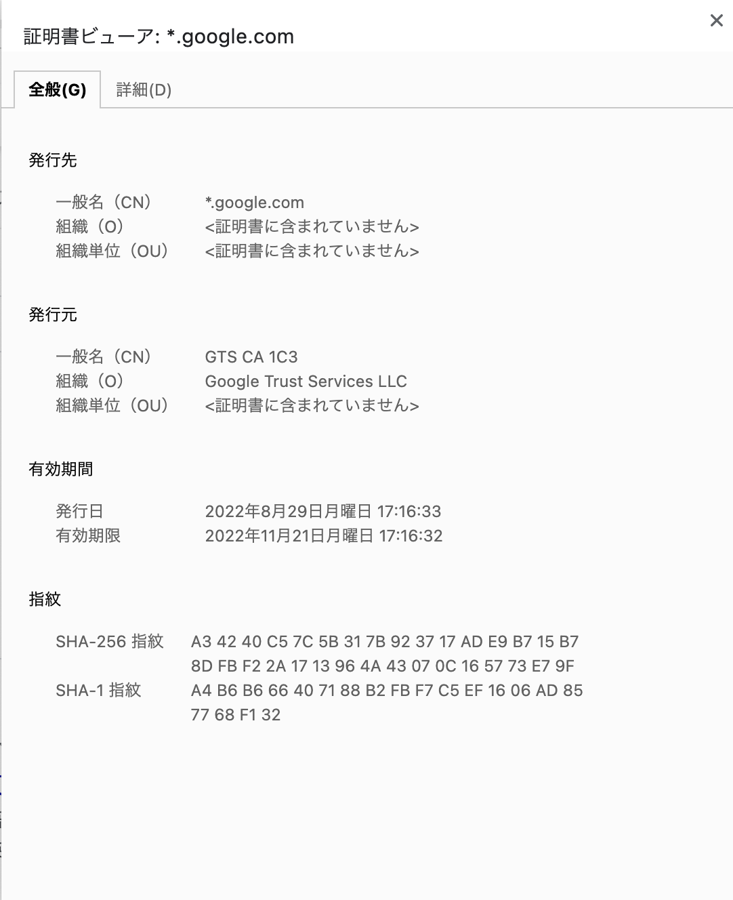

# 第12回 NET分野実習　2022年9月21日

## 量子コンピュータ
### 量子におけるデータの保存
* 量子の動きによって保存する
* 0, 1 ではない **重ね合わせ** となる
* 素因数分解が簡単になる  
  → 現在の暗号化は計算量的安全性と情報量的安全性  
  → 簡単に解かれてしまう  
* 現在は量子の動きのしきい値(?)の策定中

**マクスウェルの方程式**  
**ファインマンの物理学**
* すごい、けどめちゃ難しい

## モバイルネットワーク
* 移動中にデータを正しく受信するには？
* 送信機Aの範囲からBに移動したとき、通信をどうやって継続するか？
* 無線LANの場合は移動しない
* **実は今は継続していない**
* A→B へ移動する時は **バッファ** を使用している
* ぎり5Gのエリアにいる場合、結構途切れる(僕の部屋がそう。めっちゃ分かる)

## セキュリティ
* ブラウザの鍵マーク

**SSL証明書**  


**保護されていない場合**  


**この接続は保護されています** が重要
* 通信経路上では暗号化されていることが担保されている
* スーパーコンピューターでも1000年かかる
* が、解かなくても突破できる技術ができたりしたら意味がなかったり...
* WEP が何万年かかると言われていたが...現在は1分で解けてしまう
* 磁気読み取りは脆弱 → ICカードとかに移行
* 狼煙も実は暗号化されている
  * お互いが照らし合わせなければ意味がわからない


### 暗号化の目的
#### 盗聴（機密性）
* 不正な手段で、他人の通信データを参照すること
* データの暗号化によって防止できる
#### 改ざん（完全性）
* 他人の通信データの内容を書き換えること
* メッセージ認証やデジタル署名によって防止できる
#### なりすまし（正当性）
* 他人になりすまし、その人のように振る舞うこと
* 認証局による認証によって防止できる
* ただし認証局の信頼が必要

<br>

* 通信中は安全が担保されていても、その先はわからない
* 無闇にクレジットカード打たないようにしよう

## 暗号化の歴史
1. 紀元前19世紀 **ヒエログリフ**
  * 一般人には読めなくした
2. 紀元前5世紀 **スキュタレー**
   * 棒に布を巻いている
   * 同じ太さの棒がなければ読めない
   * 道具を使う初めての暗号
3. 紀元前2世紀 **ポリビュオス暗号**
   * 文字をランダムに並べた 5x5 の変換表を用いる
4. 紀元前1世紀 **シーザー暗号**
   * 元の暗号から一定数ずらす

### 古典暗号 戦時中
#### モールス信号
* `・` と `-`
* これ自体は暗号ではない
* モールス信号により無線通信の量が飛躍
* 
#### 機械式暗号装置 **エニグマ**
* ドイツの暗号機
* ギアの組み合わせで暗号分が変わる
* 解読した人が **アラン・チューリング**
* **チューリング完全**(全てのことをできるという証明?)
* マイクラ, マリオメーカーetc.

```
古典暗号は1対1である
```

### 現代暗号
* いろんな人が聞いている状態
* 暗号アルゴリズムも公開されていても問題ない
* アメリカ政府 DES暗号

#### ジョン・フォン・ノイマン
* めちゃ、すごい

### 暗号方式
#### 単一換字式
* `A→D`, `B→X` のような1対1の繋がり
* 単一換字式の欠陥 **頻度分析**
#### 複数変換方式
* `A→D`, `A→X` のような1対多の繋がり
* これでも**頻度分析**が使える
#### DES暗号
* とても脆弱
* トリプルDESは脆弱なDESの段階をふやした感じ
#### 共通鍵暗号(対称暗号)
* シーザー暗号 **n**文字ずらす → **n**文字戻す
#### 公開鍵暗号
#### ハイブリッド暗号
#### ワンタイムパッド

#### 文字コード
* 現在はUnicordが世界基準
* 全てのデータは数字で表される（文字も）
* Unicord は今後増えても問題ない(可変)
* Unicordでもフォントが対応してなければ意味なし
  * **NoTo SANS** Googleが開発している(NoToシリーズ色々)
  * Nomore Tofu 豆腐がない(対応してない文字がない)
* 絵文字は日本発祥
  * 英語圏では 📛(名札) → Tofu On Fire!!
* CJK(中国,日本,韓国) の漢字圏はフォントデータがでかくなるから別物扱い
* 普通の文字 + "旧字体用サブセット(?)" = 旧字体
* くさびがた文字もUnicord対応している
```
𒁣	𒁤	𒁥	𒁦	𒁧	𒁨	𒁩	𒁪	𒁫	𒁬	𒁭	𒁮	𒁯   𒁰   𒁱	𒁲	𒁳	𒁴	𒁵	𒁶	𒁷	𒁸	
```

## 暗号理論の論文
* 送信者:アリス, 受信者:ボブ, 盗聴者:イブ がとても多い

## 共通鍵暗号/公開鍵暗号 (混ざってしまった...)
* 鍵を渡している途中で盗聴されたら...?(根本的な問題)
* **鍵を安全に渡す方法はない**
* **鍵さえあれば暗号化,復号化が簡単**
* めっちゃ安全だけど準備が面倒
* 全部のデータを暗号化するのは実質不可能
* 今後公開鍵が必要なくなる?

1. 閉める用の鍵と開ける用の鍵がある
2. 閉める用は公開されていて(公開鍵)、開ける用は秘密(秘密鍵)
3. 送信者はだれでも見れる公開鍵を用いて閉めて送信
4. 受信者は自分だけの公開鍵を用いて復号


**サマーウォーズの「お願いしまーーーす!!」はえぐい**

## ハイブリッド暗号
* 通信自体は共通鍵暗号
* 鍵だけ公開鍵暗号によって渡す
* SSL, TSLなどめっちゃ使ってる

1. 証明書を認証局から受け取る(公開鍵)
2. 相手からデータをもらう
3. 復号する

## RSA暗号の安全性
* RSAは公開鍵方式のひとつ
* RSAは開発者3人の頭文字

### 解き方
**えぐい**

## その他の暗号技術
* メッセージ認証コード
* デジタル署名
* 疑似乱数生成器
  * コンピューターは実際は乱数ではない(乱数に見せかけているだけ)


## 次回
* ペネトレーションテスト
* 実際に攻撃してみよう
* 悪用しないように...

<br>

## メモ
* なんの言語でもいいから素因数分解してみよう  
[Pythonならこの辺?](https://ictsr4.com/py/m0120.html)

<br>

## 感想
