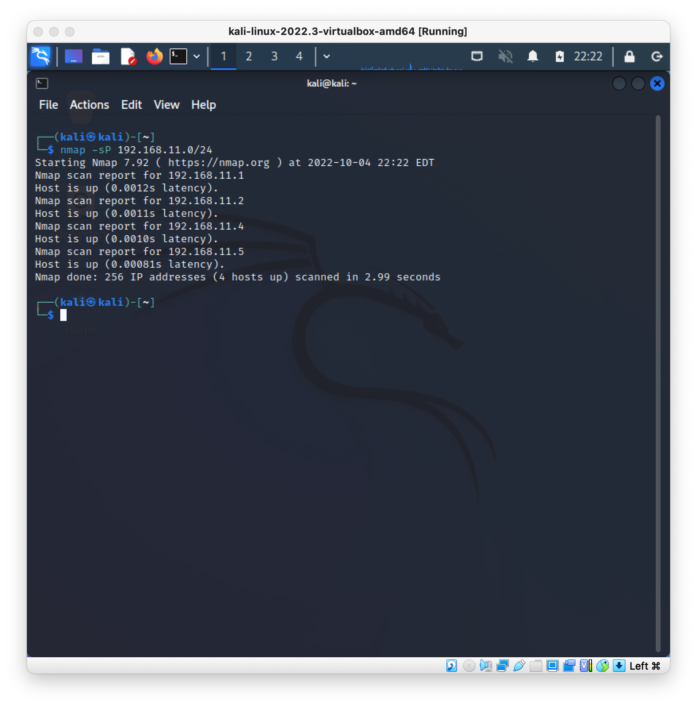

# 第16回 NET分野実習　2022年10月5日

## 目次
- [第16回 NET分野実習　2022年10月5日](#第16回-net分野実習2022年10月5日)
  - [目次](#目次)
  - [ノーベル賞](#ノーベル賞)
    - [量子もつれ](#量子もつれ)
    - [医学賞](#医学賞)
  - [コンピューターセキュリティ](#コンピューターセキュリティ)
    - [使うもの](#使うもの)
    - [前提](#前提)
      - [守るもの](#守るもの)
      - [どう守るか](#どう守るか)
    - [目的](#目的)
    - [対策を考える上での観点](#対策を考える上での観点)
      - [３つ](#３つ)
      - [ISOでの追加事項](#isoでの追加事項)
    - [脅威](#脅威)
    - [個人情報](#個人情報)
      - [該当するもの](#該当するもの)
      - [該当しないもの](#該当しないもの)
      - [要配慮個人情報](#要配慮個人情報)
      - [特定個人情報](#特定個人情報)
    - [セキュリティポリシー](#セキュリティポリシー)
    - [インシデント対応のフェーズ](#インシデント対応のフェーズ)
    - [インシデントの予防](#インシデントの予防)
    - [パスワード](#パスワード)
      - [サービス運営者側の対応](#サービス運営者側の対応)
      - [利用者の対応](#利用者の対応)
    - [証明書と認証局、電子署名](#証明書と認証局電子署名)
    - [ウイルススキャン](#ウイルススキャン)
    - [パッチ](#パッチ)
  - [実践してみよう **ペネストレーションテスト**](#実践してみよう-ペネストレーションテスト)
    - [準備](#準備)
    - [実践](#実践)
  - [メモ](#メモ)
  - [感想](#感想)

## ノーベル賞

### 量子もつれ
* 元々ついとなっていた量子同士はどれだけ遠くにあっていても、片方を観測すればもう一方の状態もわかる
* 光速を超えて情報伝達ができる(?)
* アスペの実験
  * アインシュタインの説明(?)は間違っていることを対偶で証明
  * 量子もつれが事実だとわかった
  * 数式ではなく実験で

### 医学賞
* DNAによって病気のなりやすさが変わる
* 日本人にはネアンデルタール人と何かの3種の混血

## コンピューターセキュリティ

### 使うもの
* Kali Linux (攻撃側)
* Metasploitable2

### 前提
#### 守るもの
* 個人情報

#### どう守るか
* USBメモリの持ち出し
* 外部からの閲覧
* * 書き換えられたくない
* 意図しない動作を防ぐ

### 目的
* 法律に定められている
* 契約に盛り込まれている方
* 自分自身の情報や財産を守るため

### 対策を考える上での観点
#### ３つ 
* 機密性
  * 許可した人のみが情報に触れることができる
* 完全性
  * 情報が想定した状態から改ざんされておらず、信頼に足る状態である
* 可用性
  * 情報に触れられる人は、いつでもその情報に触れられる

#### ISOでの追加事項
* ISO 27001 は国や世界で使える
* 必ずしも漏れないわけではない
* 真正性
  * 署名や認証を用いて利用者が適正であることやデータが改ざんされていないこと
* 責任追跡性
  * いつ何が起こったかを追跡・追求できること
  * 履歴ログが残っており、それが改ざんされておらず、システムの挙動を追跡できるものが残っていること
* 否認防止
  * 発生事象や作成されたデータを後でなかったものにされないこと
* 信頼性
  * システムの処理が適切であり、矛盾なく動作できる構成であること

### 脅威
* 情報漏えい(機密性の侵害)
  * 機密である情報が外部に出ること
  * 個人情報漏えい事件など
* 改ざん(完全性の侵害)
  * 第三者によって情報が書き換えられること
  * 企業の Web サイトの改ざんなど
* サービス妨害(可用性の侵害)
  * 第三者によってサービス提供が邪魔されること
  * 「脆弱性を狙われる」「想定外の通信要求を外部から行われる」などのことで、サービス自体の提供が行えなくなるなど

### 個人情報

#### 該当するもの
* 個人を識別できる情報
* 「**生存する個人**」の「当該情報に含まれる氏名、生年月日その他の記述等により特定の個人を識別できるもの」
* 部分的な情報であっても、他に入手可能な情報と組み合わせると個人が特定できてしまう情報も個人情報に含まれる
* 生存していなくても、血縁関係等で影響があれば守られる

#### 該当しないもの
* 個人を識別できないように加工されたもの
* 個人の行動情報を集めて**統計処理**を行った情報は、個人情報に含まれない

#### 要配慮個人情報
* 特に気をつける必要があるもの
  * 人種
  * 社会的身分
  * 信条や宗教
  * 病歴
  * 犯罪歴

* 自ら公開するのは問題ない
* これらの情報は、本人に対して何らかの不利益とならないように配慮が必要な情報であり、
法律上、第三者への情報提供は本人が認識できる形での同意に基づいてのみ認められます。

#### 特定個人情報
* マイナンバーを付け加えたもの
* 「マイナンバー」は通常の個人情報より更に厳密に取り扱われるべきものとされている
* 「 税 」「 社会保障 」「 災害対策 」に関わる情報を個人情報と関連付けて取得することができるため
* マイナンバーを扱うことが許可されている取扱者
  * 国
  * 地方自治体
  * 税金、社会保障の手続きを行う事業者 のみ
* 第三者提供は、一部の例外を除いて不可
* 不適切な利用を行った場合、刑事罰による罰則規定があります。

### セキュリティポリシー
* 企業及び団体等の組織が、「セキュリティに関する基本的な方針」を定めたもの
* セキュリティポリシーを定める
  * 組織の目的や目標を明確にする
  * 経営層の関与・承認
* セキュリティポリシーはあくまでも方針のみ
* 運用を行うには、 `スタンダード基準` と `プロシージャ手順` を制定する必要がある


### インシデント対応のフェーズ
1. 検知
   * 実際に攻撃による被害が発生していることを様々な手がかりから検出し、知る
   * 調査の引き金
     * 自組織が持つ検知システム (IDS や SIEM) からの通知
     * SOC( セキュリティ監視拠点 からの通知
     * 外部組織からの通知

2. 初動対応
   * 原因をできる限り正確に把握し、被害を最小限に抑えるため迅速な対応が必要
   * 初動対応の手順
     1. 対処に必要な体制の確立
     2. 現状把握と被害の最小化
     3. 原因や攻撃経路の特定及び対処
3. 復旧
   * 被害を受けた機器の修復 再構築を行い、原因を見直し再度同じ事象が発生しないように対処を行う
4. 事後対応
   * 最終報告書の作成
   * 他に同様な被害を受ける可能性のあるシステムの調査と対処

### インシデントの予防
* 「認証」と「認可」
  * 利用者の特定認証と利用サービスの限定認可を行うことで、対象者と対象サービスを制限する
* 暗号化
  * データを容易に読めなくする
  * パスワード再設定をしてみよう
* ハッシュ
  * 暗号の一部で、データの改ざん検知に利用できる
* ハードニング 要塞化
  * 外部公開のサービスを局所化、動作プログラムの把握、不要プログラ停止、
    脆弱性の対策パッチの適用、セキュリティソフトウェアの導入、
    ネットワーク上における多重防御の導入 など

### パスワード
#### サービス運営者側の対応
* パスワードは、外部に漏れてしまっても容易に読めないように暗号化・ハッシュ等を行って保存する
* パスワードリセットの方法は、「登録されているメールアドレス」にパスワードリセットのための URL を記載し送信するなどが主流
* パスワード を 平 文で送ってくるようなサービスは使わない こと

#### 利用者の対応
* 容易に推測できるパスワードは使用しない
* 大文字小文字数字記号を組み合わせる
* 辞書に記載のある英単語は極力避ける
* 複数のサービスで同じパスワードを使用しない
* なるべく文字数を増やす
* その他の認証要素
  * 生体認証
    * 顔、指紋、手のひら静脈、網膜・虹彩など
    * 確実とは言えないため単体は避けるべき
  * ワンタイムパスワード
    * 一度だけ使用できるパスワード
  * 二要素認証
    * 素性の異なる2種類以上の情報を組み合わせて認証を行う
    * 例えば、ユーザーID, パスワードによる認証後、携帯電話のSMSを用いての認証を行う等
  * シングルサインオン
    * OAuth などの 1 つの認証サービスを複数のシステムで使いまわす

### 証明書と認証局、電子署名
* 証明書
  * 暗号化されたデータを作ることができるのは鍵を生成した人だけであることを証明する
* 認証局
  * 信用のある企業が証明書の発行を行うことで、契約者が本人であることを証明する
* 電子署名
  * データの作成者は証明できる人物であると言える仕組み
* これらの技術は、 SSL/TLS で実装されている。
* HTTP ではなく HTTPS を使おう
* ネットワーク管理者なら、 Telnet ではなく SSH を使おう

### ウイルススキャン
* 悪意のあるソフトウェア,マルウェアのバイナリパターンから、システム上のデータの検査・隔離を行う
* 振る舞いを検出して悪意のある動作を抑止
* ユーザーがアクセスしようとしている Web サイトが、過去に悪意のある行動をしているかどうかを確認しブロックする
  * **レピュテーション**
* Googleドライブに入れてファイルをスキャン
  * RAR 等の圧縮は一切いれない

### パッチ
* セキュリティパッチは必ず当てよう
* サポート期限の切れたソフトウェアは、脆弱性の穴を塞ぐパッチがリリースされないため、絶対に使用しない

<br>

## 実践してみよう **ペネストレーションテスト**

### 準備
1. 環境　設定から `NatNetWork` 追加
2. `metasploit` 追加

  

3. klai 追加
   * `kali-linux-xxx-amd64.vbox` をダブルクリック
4. NatNetWork に参加
5. metasploit 起動

   

   ```
   user: msfadmin
   pass: msfadmin
   ```
6. kali 起動
7. 
   

   ```
   user: kali
   pass: kali
   ```

### 実践


* IPアドレスを調べる
   ```
   ifconfig => 192.168.11.3
   ```
* *IPスキャン
   * 使用済みIP をリストアップ
   ```
   nmap -sP 192.168.11.0/24
   ```

   

* ポートスキャン
   * 空いているポートと使用アプリ/バージョンをリストアップ
   ```
   nmap -sV 192.168.11.3/24
   ```

   

* `msfconsole`
  *置いてかれた...*

* 管理者権限とれる `root` ユーザー
* [CVE](https://www.cvedetails.com/)

<br>

## メモ
- [ ] 量子もつれ
* gmailのエイリアス機能
```
hoge@gmail.com を持っているとする
登録時 hoge+fuga@gmail.com とする(fugaはなんでもいい, fugaはサービス名など)
届くのは hoge+fuga@gmail.com
漏れたのは fuga からだとわかる
```

<br>

## 感想
