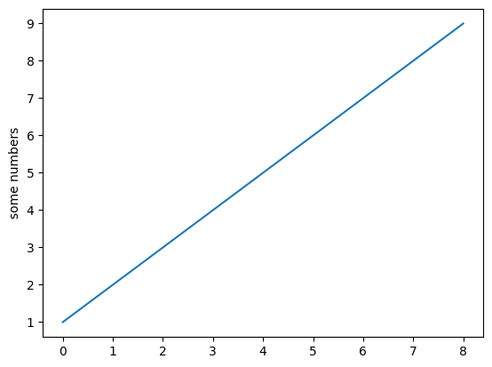
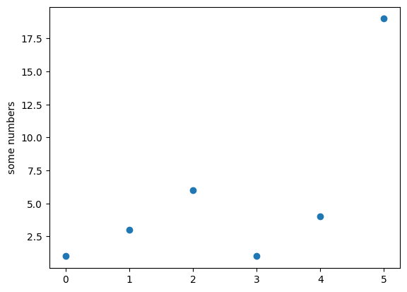
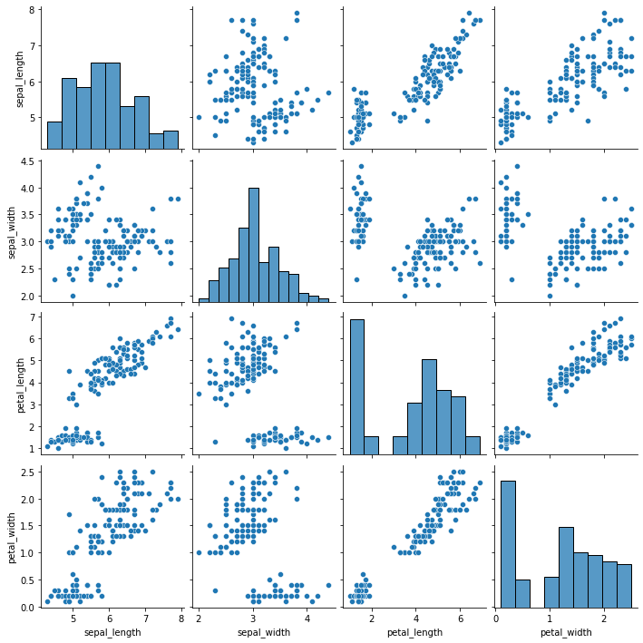
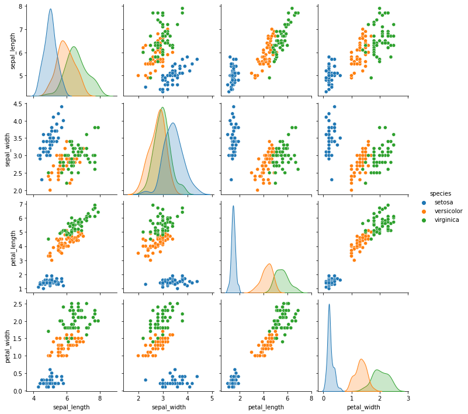
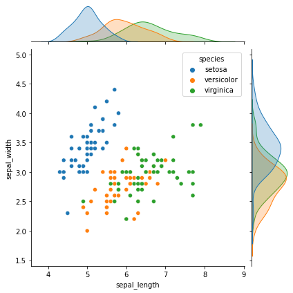
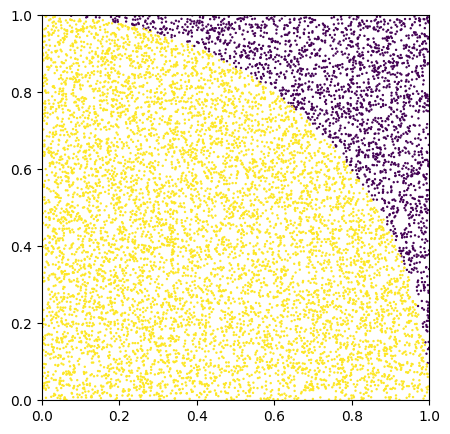
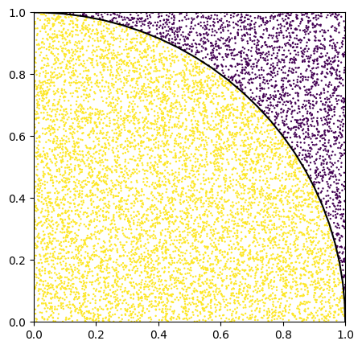

# 第18回 NET分野実習　2022年10月29日

## Google Colaboratory
- Googleが提供する基本無料のPythonの環境を使用できるサービス

## 機械学習
- あくまでも条件分岐
- ばらばらで曖昧なサンプルデータから基準を決める

## jupyterlab
```shell
pip install jupyterlab
jupyter lab
```

## ライブラリ
- 使うライブラリ
  - numpy
    - 数学計算
  - matplotlib
    - グラフ描写
  - seaborn
  - pandas
    - 色づけ(なくてもOK)
    - データ分析のためのデータ管理

## データ分析
### 線グラフ
```python
improt matplotlib.pyplot as plt
data = range(1, 10)
plt.plot(data)
plt.ylabel('some numbers')
plt.show()
```



- マークダウンやテキスト(RAW)も書ける

### 点のグラフ(?)
```
data_x = [0, 1, 2, 3, 4, 5]
data_y = [1, 3, 6, 1, 4, 19]
plt.scatter(data_x, data_y)
plt.ylabel('some numbers')
plt.show()
```



[matplotlibの使い方](https://matplotlib.org/)


### あやめ科3つのデータを表にする
```python
iris = sns.load_dataset('iris')
sns.pairplot(iris)
plt.show()
```




### データごとに色付け
```python
iris = sns.load_dataset('iris')
sns.pairplot(iris, hue="species")
plt.show()
```



### データを連結
```python
sns.jointplot(x="sepal_length", y="sepal_width", data=iris, hue="species")
plt.show()
```




## モンテカルロ法を使って円周率を求める
[これ](http://www.cmpt.phys.tohoku.ac.jp/open-campus/2020/pi/)

```python
plt.figure(figsize = (5,5)) # グラフのサイズ設定
plt.axis([0, 1, 0, 1])
r = np.random.default_rng()
pi = []

for j in range(100):
    for i in range(100):
        x = r.random(10000) # 10000個生成
        y = r.random(10000)
        inc = np.count_nonzero(x**2 + y**2 < 1)
        pi.append(inc*4/10000)

    print(np.mean(pi)) => 3.1451840000000004
```


```python
plt.figure(figsize = (5,5)) # グラフのサイズ設定
plt.axis([0, 1, 0, 1])
r = np.random.default_rng()

x = r.random(10000) # 10000個生成
y = r.random(10000)
inc = np.count_nonzero(x**2 + y**2 < 1)

c = x * x + y * y < 1
plt.scatter(x, y, c=c, s=0.5) # cは色の指定(True, False だと二色になる)
```



```python
plt.figure(figsize = (5,5)) # グラフのサイズ設定
plt.axis([0, 1, 0, 1])
r = np.random.default_rng()

x = r.random(10000) # 10000個生成
y = r.random(10000)
inc = np.count_nonzero(x**2 + y**2 < 1)

c = x * x + y * y < 1
plt.scatter(x, y, c=c, s=0.5) # cは色の指定(True, False だと二色になる)

t = np.linspace(0, np.pi)
gx = np.cos(t)
gy = np.sin(t)
plt.plot(gx, gy, lw=1.5, c="k")
```



これを使えばきゅうりのランク付けをしたり...

```python
print(type(iris)) => <class 'pandas.core.frame.DataFrame'>
```
- iris のデータ形式は pandas である  
- svg形式 でもおけ  
- 分析するには データ(特に**数理モデル**) にする必要がある


### モンテカルロ法とは
`1%` のガチャを引いた時に必ずあたりが出る確率は... `63%`  
なぜなら...コンピュータのガチャは何度ハズレを引いても あたり と はずれ の割合は変わらないから


## データ分析
- データを分析(タイタニック号が沈んだ時に生きれた人の条件は?)
- 現実にあるデータから相関関係を調べる


## 疑似相関
- 関連性が無いように見えて間接的に関連がある
  - 風が吹けば桶屋が儲かる
  - 水難事故が増えるとアイスが売れる
  - パンは危険な食べ物 (犯罪者の98%が食べている)
- 疑似相関は悪用できてしまう
  - 税金上げたら売上があがった
  - 実際さげてもあがるのでは...?
## 生存者バイオス
- 成功事例のみをみて判断してしまう
- 失敗した場合のデータは反映されてない

## メモ
- ライブラリに頼りすぎると、それが使えなくなると使えなくなるとできなくなる
- データセットや、分析の大会(?)などをしている [kaggle](https://www.kaggle.com/)

## 感想
