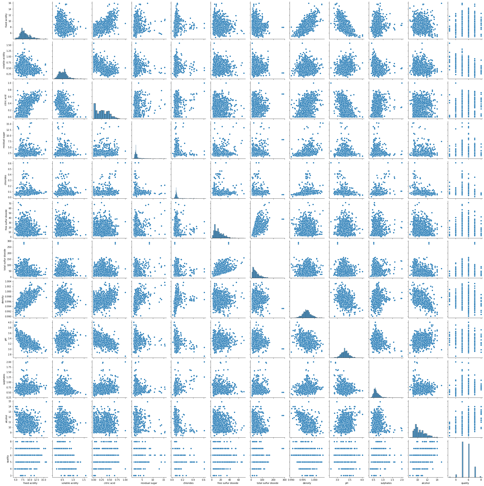

# 第19回 NET分野実習　2022年11月2日

## データ
csv
- 通常は "," で区切られる
- ";" で区切る場合もある

## 単回帰分析
- 分散データの集合から　`y = ax + b`　の形式にモデルを算出


## 実践
1. [モデルデータ](https://archive.ics.uci.edu/ml/machine-learning-databases/wine-quality/) をダウンロード
2. コード
```python
import numpy as np
import pandas as pd
import matplotlib.pyplot as plt
from sklearn import linear_model
import seaborn as sns

df = pd.read_csv('winequality-red.csv', sep=';')
df.head()

sns.pairplot(df)
plt.show()
```
3. 結果

