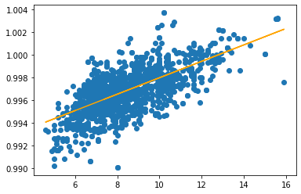

# 第19回 NET分野実習　2022年11月2日

## データ
csv
- 通常は "," で区切られる
- ";" で区切る場合もある

## 単回帰分析
- 分散データの集合から　`y = ax + b`　の形式にモデルを算出

## 重回帰分析
- `y = a1x + a2x + a3x + ... anx + b` の形式にモデルを変換


## 実践
1. [モデルデータ](https://archive.ics.uci.edu/ml/machine-learning-databases/wine-quality/) をダウンロード
2. データをそのまま
```python
import numpy as np
import pandas as pd
import matplotlib.pyplot as plt
from sklearn import linear_model
import seaborn as sns

df = pd.read_csv('winequality-red.csv', sep=';')
df.head()

sns.pairplot(df)
plt.show()
```
3. 結果


4. 単回帰分析のために相関がありそうな "酒石酸濃度" と "密度" をデータを変換
```python
x = df.loc[:, ['fixed acidity']]
y = df[["density"]]

plt.scatter(x, y)
plt.show()
```


5. 線形モデルを使った単回帰分析
```python
clf = linear_model.LinearRegression()
clf.fit(x, y)

print(f'係数: {clf.coef_[0][0]}')         # y=ax+b の係数 "a"
print(f'切片係数: {clf.intercept_[0]}')    # 切片係数 "b"
print(f'スコア: {clf.score(x, y)}')   # 決定係数 計算した y=ax+b と  x, y を比較してどれほど正確かの方程式
```
```
係数: 0.0007241577183648047
切片係数: 0.9907219496290315
スコア: 0.44628718450749494
```

6. 計算結果から予測
```python
density = 8.0
print(f'予測 {(density * clf.coef_ + clf.intercept_)[0][0]}')   # => 予測 0.9965152113759499
print(f'predict: {clf.predict([[a]])[0][0]}')                   # => predict: 0.9965152113759499
```

7. グラフ化
```python
x = df.loc[:, ['fixed acidity']]
y = df[["density"]]

plt.scatter(x, y)
plt.plot(x, clf.predict(x), color='orange')
plt.show()
```



8. 最終的に予測したい品質(quality)を除外して取り出す
```python
a = df.drop('quality', axis=1)
q = df['quality']
q.head()
```

9. 計算結果
```python
clf = linear_model.LinearRegression()
clf.fit(a, q)
print(f'計算結果:')
print(pd.DataFrame({'データ名': a.columns, '係数': clf.coef_}))
print(f'切片係数: {clf.intercept_}')
print(f'スコア: {clf.score(a, q)}')
```
```
計算結果:
                    データ名         係数
0          fixed acidity   0.024991
1       volatile acidity  -1.083590
2            citric acid  -0.182564
3         residual sugar   0.016331
4              chlorides  -1.874225
5    free sulfur dioxide   0.004361
6   total sulfur dioxide  -0.003265
7                density -17.881164
8                     pH  -0.413653
9              sulphates   0.916334
10               alcohol   0.276198
切片係数: 21.96520844944842
スコア: 0.3605517030386881
```

- 係数だけみて相関性を決めてはいけない
- 重回帰分析は複数の値を使用できる(AI等ではこっちを使う)
- 大量のデータを扱うことはコンピューターに任せる
- どんなデータを集めるかは人間が考えなければいけない
- 人間ができる部分は人間
- 人工知能が何をしているか知ろう


## 実践
MNIST による手書き文字のデータセットを学習させ、自分の手書きデータを認識させる
使用ライブラリ
- [Gradio](https://gradio.app/)w
  - 書いたものを簡単にモデルへわたせるGUIツール
- MNISC
  - 大量の数字の手書きデータ
- tensorflow
  - 機械学習ライブラリ

1. データセットの取得と表示
```python
import tensorflow as tf

(x_train, y_train), (x_test, y_test) = tf.keras.datasets.mnist.load_data()
(fig, ax) = plt.subplots(nrows=1, ncols=5, figsize=(12, 12), tight_layout=True)

for i in range(5):
  ax[i].imshow(x_train[i], cmap=plt.cm.gray_r)
  print(y_train[i], end='')
```


2. 画像データを正規化し、0~1のデータにする
3. シーケンシャルモデルによる変換定義
```python
# 2
x_train = x_train / 255.0
x_test = x_test / 255.0
# 3
model = tf.keras.models.Sequential([
    tf.keras.layers.Flatten(input_shape=(28, 28)),
    tf.keras.layers.Dense(128, activation='relu'),
    tf.keras.layers.Dense(10, activation='softmax')     # グラフを滑らかにする(?)
])
```
4. `gradio` で GUI から手書きデータを画像化し、なんやかんや
```python
import gradio as gr

def func(img):
  img = img.reshape(1, 28, 28)
  pred = model.predict(img).tolist()[0]
  return {str(i): pred[i] for i in range(10)}

label = gr.outputs.Label(num_top_classes=3)
interface = gr.Interface(fn=func, inputs='sketchpad', outputs=label, liye=True)
interface.launch()
```


## 感想
