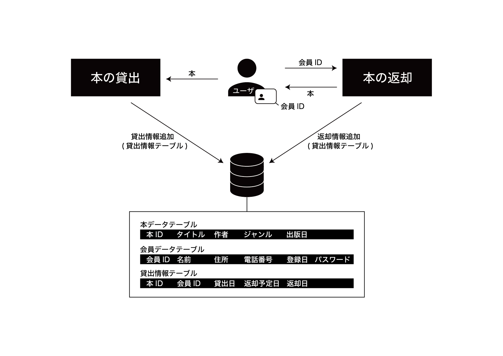

# 第22回 NET分野実習　2022年12月14日

## 前回のおさらい
- json でアドレスを保存するwebAPIを作った
- 大量のアクセスには DB を使用すべき
- json は DB に置き換えれる

## 情報システムの設計
- システム
  - 複数の要素が有機的に関係しあい、全体としてま とまった機能を発揮している要素の集合体。 組織。系統。仕組み。(?)
- 要件
  - 複数の構成要素からなる
  - 構成要素間に関係・関連・構造・秩序がある
  - それらがひとつの`システム`を作る
  - `システム`自体が一つの機能を持つ
- Googleの他とちがうところ
  - データの量
- 情報システムの要素
  - 技術的要素
    - 入出力したりする装置
  - 社会的要素
    - 個人や組織などの社会を構成する要素
    - 人によるコミュニケーション そのものである場合が多い
    - 図書館ではユーザーの個人情報など
    - 共通認識でできる
    - `日本語で話す`も社会的要素
  - 自然的要素
    - 扱いが難しい
    - 擬似的な数値化は可能
    - `温度`, `湿度`など
    - ラプラスの悪魔
    - 気温10度
      - 10度は人が決めたものでしかない
      - 全ての情報をもっている訳ではない

## 問題とシステム
- とある雑貨店を営む店主の悩み
  - 中学生や高校生が多くにいるように見える
  - 中高生をターゲットにした雑貨を多く仕入れている
  - 在庫を見ると売れ残りが多数発生している
  - 売れ残り在庫は処分となる場合もある
  - 売れ残り在庫をそもそも発生させなくしたい
- 解決策を考えるに当たって
  - 例
    - 雑貨店のお客さんは、どんな人が多いか
    - お客さんの来店状況と、売上状況に相関はあるか
    - 商品の仕入れの際に中高生をターゲットにしているが、中高生が買っていく商品を把握できているか
  - その商品は本当に中高生向けなのか
  - 中高生の来店の目的は買い物なのか(ネットショッピングの下見 etc.)
  - 中高生その他のお客さんの買う量の比較
- 解決策
  - 顧客の分析を行う必要がある
    - 会員カードをつくる
      - メリット
        - 商品のターゲットがわかる
        - 購入者の情報を振り分けられる
        - 個人の買うもの頻度居住地が得られる
      - デメリット
        - 会員カードに対するリターンが必要(コスト)
        - ポイントに有効期限がないと後に利益が削られてしまう可能性がある
    - 店員が性別が年齢層を確認する
      - 個人情報保護法に抵触する恐れがある
      - 情報の収集に同意してもらう必要がある
- 損益分岐点
  - 利益が 0 となる売り上げ規模
- 通常は転職すると給料が下がる
- IT系は上がる傾向にある
- 株式会社は最低16万でできる(が資本は0)
- システムの中での役割を考える
- [名前と誤謬](http://emptypage.jp/translations/kalzumeus/falsehoods-programmers-believe-about-names.html)
- 名前の入力欄でも気をつける必要がある

## システムの機能の表現
- 文章を読める人ばかりではない
- システムの図式化
  - 表現方法は一つではない
  - ブラックボックス化
    - 中での処理は分からないが入力に対して出力を得られる
    - ブラックボックスをなくすと詳細の設計が得られる

## 図書館の貸し出しシステムをつくる
- 目的を見失わないように全体を見ながら
- ポイント
  - 登場人物を考える
    - 借りる人, 本, 図書館
  - 情報の流れを考える
  - 入力機器の選定は必要なもののみで構成する
- 機能

## 実際に設計
- 今回は書き方に指定はない

## 感想
今まで出席確認などのシステムを制作してきたが、設計をしておらず完成してから頭の中で設計し直してまた作り直すという事を繰り返していた。
はじめから設計をしてからにすればよかったと思う。  
また、仕事では1から作り直す余裕がないと思うので、そのシステムが実用的なものなのかを完成してからではなく設計段階で判断するとよいと思った。
