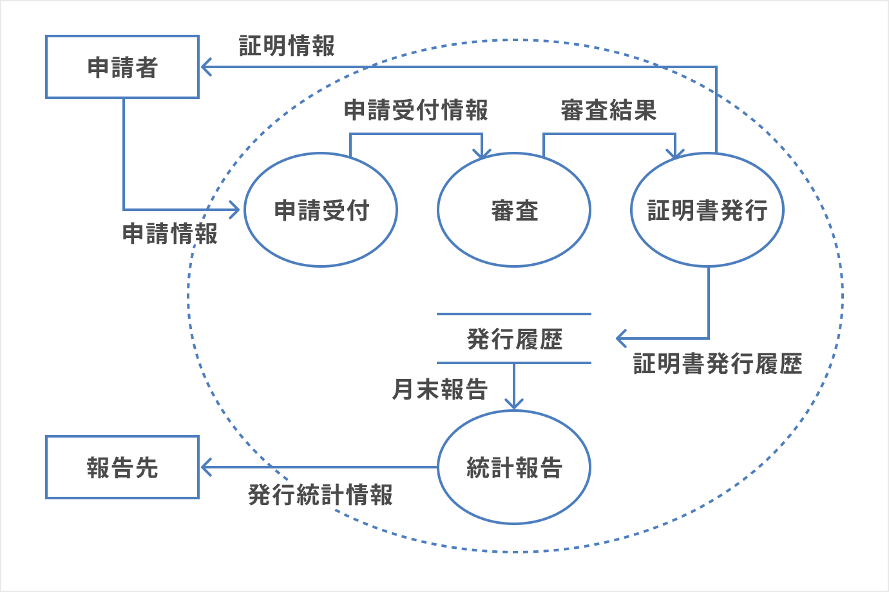
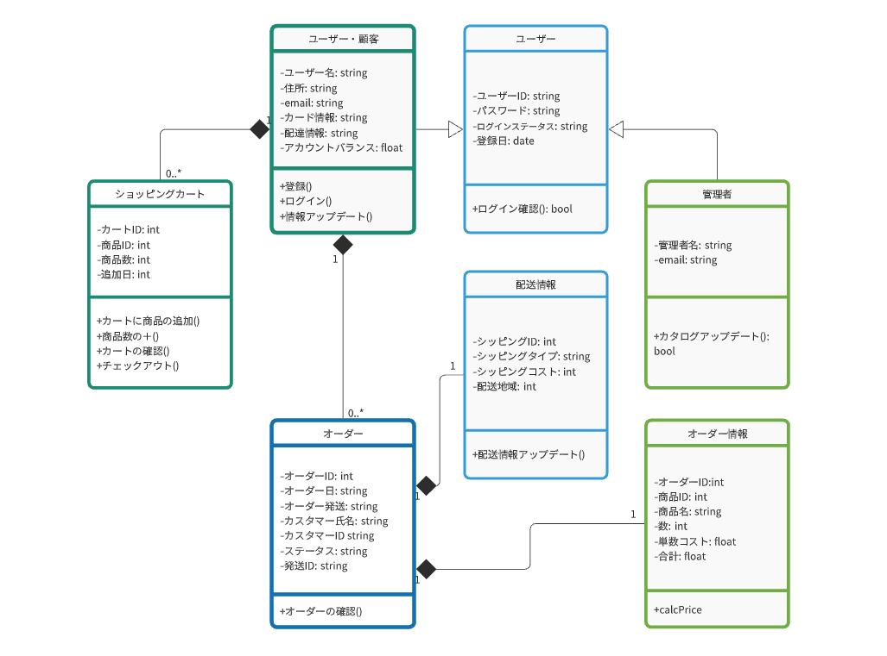
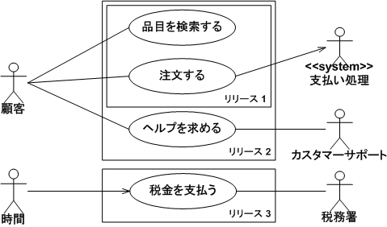
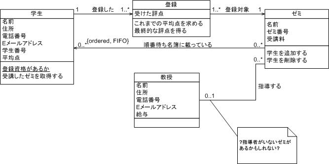

# 第23回 NET分野実習　2022年12月21日

## システム設計
- システム設計に明確な基準はない
- プログラムと違ってエラーは出てこない
- 想像力が必要
- 設計をしないと機能追加で作り直す必要が出てくる
- 設計の種類
  - 要件定義
    - 問題提起
    - 今回の顧客は自分自身
    - どういうシステムが必要なのか
    - 要望, 要求, 要件
  - 基本設計(外部設計)
    - システムを外側から見たらどう見えるか
    - 要件を満たすために作るものを決める
    - システム仕様, 機能仕様, 画面仕様
    - 5W2H の 5W の部分を考える
      - When  : いつ
      - Where : どこで
      - Who   : だれが
      - What  : なにを
      - Why   : なぜ
      - How   : どうやって
      - How much : いくらで(掛ける時間)
    - 書かないこと
      - どう作るか
      - 5W2H の How の部分
  - 要件定義
    - システムで必要な機能を定義
    - システムに実装する機能(機能要件)
    - 求める性能やセキュリティ(非機能要件)
      - 本来必要な機能ではないけど、より良くなるもの
      - マイナンバーカードは光に弱くすることでセキュリティを高めている など
      - コストに見合った性能を決める
    - 導入計画・スケジュール(クリティカルパス)
    - 人員の体制を考える
    - 要望を要求にし、要件に落とし込む
      - 要望: ~という問題がある, ~したい
      - 要求: ~するには~が必要
      - 要件: ~が必要だから、~を作る
    - コミュ力が大切
      - 確認する力, 情報を正確に伝えて読み取る
    - 日常生活で要件定義しないように
      - 問題解決したい人だけにしよう
  - 詳細設計
    - どうやって作るか
    - どうやって動作確認するか(テスト仕様書)
        ```
        ret <- add(a, b)
        a, b は数値
        ret は a+b
        (TypeScript の型宣言てきな?)
        ```
    - 実際はプログラムと同時に書くことが多い
    - ユーザーに出すものではない
    - プログラマが書くことが多い
    - 新人は詳細設計がある段階から行うことが多い
- 設計ツール
- DFD(Data Flow Diagram)
  - [CACOO](https://cacoo.com/ja/)
  - システムにおけるデータの流れをインプット、アウトプット、処理やデータの保管について書いた図
  - データの流れを書いた図
  - 全てを書くことはできない(データの流れのみ)
  
- ER図(Entity Relationship Diagram)
  - データの関係性のみを表す図
  - DBの設計に使う図
  - DBを使う場合は必須
- UML(Unified Modeling Language)
  - システム全体の構造、振る舞い、相互作用をいくつかの図を組み合わせて表現し、設計・分析を行うための図
  - しっかり書く会社は少ないが、使いこなせるといいね
  - 使われにくくなっている
  - 明確沿う必要はないが参考になる
  - 統一モデリング言語
  - UMLはさまざまな図がある
    - シーケンス図
    - 配置図
    
    
    

## 設計に必要な知識
- 業務知識
  - 顧客の現状把握や課題の洗い出しに必要
  - 顧客の行う業務全般
  - さまざまな業界の知識が得られる
- プロジェクトマネジメント
  - 多数の人間を管理する能力
- 営業戦略
  - 費用面の知識
  - どうたくさん使ってもらうかの知識
- ネットワーク 
  - システムの基盤を作るのに必須
- データベース
  - データを扱うシステムの場合は必須
- テスト手法
  - 正しく行わなければセキュリティホールが大量になる

## 求められるスキル
- 人間的なスキル
  - コミュニケーション
  - 情報を正確に伝えられる
  - 書類をきちんと書ける など
- 技術的なスキル
  - 全般必要
  - 広く浅く か 狭く深く のどちらか
  - 広く浅く: なんでもできる
  - 狭く深く: 何かに特化
- 最近必要なスキル
  - 仮想化技術
  - クラウドプラットフォーム
- 人に伝わる文章を書ければプログラミングもできる
- 小説とプログラムの書き方は似ている

## システム設計練習 テーマ
- 部活の終了時間を音でお知らせしてほしい
- ターミナルから変数名を取得できるようにしたい
  - 英単語を探すとき、ブラウザを使いたくない
- 家に帰った時、親に自動で連絡して欲しい
- 雨の日の家を出る前に天気を教えて欲しい
- レシートの管理をいい感じに(?)
- 部活動出席確認システムの改善
  - システムは作った
  - 反応速度を上げたり
- 運転学校のバスの予約アプリがカス
  - UIが酷い
  - 使いずらい, 見ずらい
  - アプリが必要
- 古銭(和同開珎など)で電子決済したい
  - 今と古の融合(的な)
- VScodeでハッカータイピングしたい
  - 考えごと中にタイピング(している気分に)
- CSSをプログラミング言語にしたい
  - A. プログラミングではどんな言語使ったことある？
  - B. HTMLと、CSSかな
  - A. (プログラミング...?)
  ```css
  main {
    content: 'Hello, World!';  //-> Hello, World!
  }
  ```
- ペンギンの行動で乱数生成したい
  - バナナから出る何かで乱数生成しているやつがあった
- 校内リクルート(?)
  - 物理教えてくれる人募集
  - 数学教えて欲しい人募集
- 言葉ベクトルで辞書
  - キジ - 日本 + ニュージーランド => キーウィ
- 道草マップ
  - 早く帰れるけど帰りたくない日の寄り道を提案
- 帰宅道すごろく
  - 帰り道でおとなしく帰りたくない時
  - 店2つ進む, 車が10台通るまで休み
  - コンビニに止まった => 100円分買う

## 感想
現在制作しているアプリでは画面の仕様を考えてみたりしたが、設計としてはまだ足りないことがわかった。  
aiboのwebアプリを制作していて、sonyの専門の部署でデバッグ(QA)すると聞いた。  
大規模だから別部署にしているのかと思っていたが、テストにも専門的な知識や技術が必要だからだと思った。
