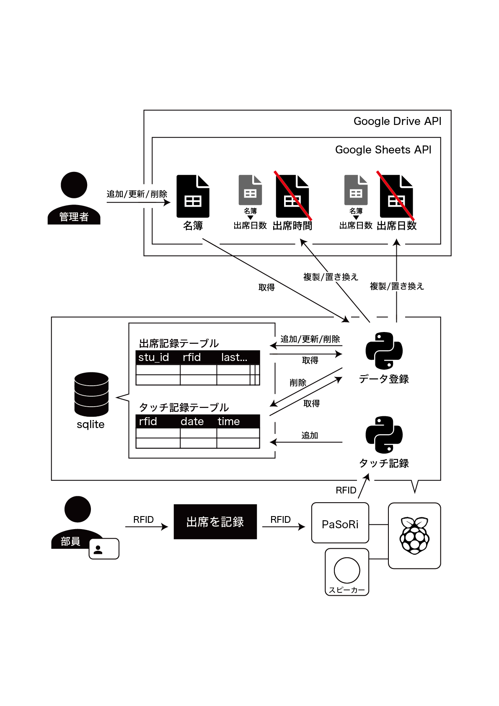
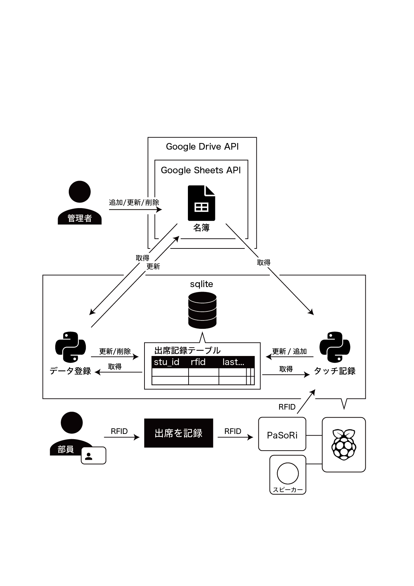

# 第23回 NET分野実習　2023年1月11日/18日 - システム設計

## システムにより解決しようとしている問題
現在部活で使用している出席確認システムの問題を解決する。  

### 現在のシステム
#### 使用機器/サービスなど
- Raspberry Pi 4B
  - Python 3.8
  - sqlite
  - PaSoRi
  - (スピーカー)
- Google スプレッドシート
- Google Apps Script
#### システム概要
- スプレッドシートの構成
  - 名簿シート (1枚)
    - 生徒情報の名簿一覧
    - 氏名, 学科, クラス, 番号, 生徒番号, RFID
  - 記録シート(月の数だけ)
    - 各月の全生徒の滞在時間を記録
    - 氏名, 学科, クラス, 番号, 生徒番号, 1~31日までの滞在時間
- 記録
  1. `PaSoRi` で `RFID` を取得
  2. データベースから RFID のタッチ記録を取得
    - DB にその日のタッチ記録が無ければ入室時間を記録する
    - 記録されていた場合、退出時間を追加/更新する
  3. スプレッドシートの 記録シート に滞在時間を追加/更新する
- シートの追加
  1. 毎日1時に AppsScript からシートのチェックを行う
  2. その日に対応する 記録シート がない場合は 名簿シート の情報をもとに自動追加する
  3. 名簿にいるのに 記録シート には載っていない部員がいた場合は追加する
  4. 学年,学科,クラス,番号順にソートし整形する

### 問題点
1. 幽霊部員でないかの判断にしか使わない割に、シートとデータが毎月毎日追加されデータが過剰である
2. シートは自動で追加されるが、もし AppsScript で問題があった場合は記録できない
3. 管理者が記録シートの変更/削除してしまった場合記録できない
4. 部員が追加された場合の処理が複雑でバグが生まれている可能性がある
5. AppsScript と RasPi側の Python の二箇所で管理しているため複雑
6. Python は RasPi が起動時に実行され永遠にループされるため、もしエラーが起きた場合は

## システムの要件定義
### システム化の目的
- 出席確認を紙でしていたため不便
- デジタル化して管理を楽にする
### システムの概要
- 対象は部員と顧問
### システムの構成
- 使用機器/サービスなど
  - Raspberry Pi 4B
    - Python 3.8
    - sqlite
    - (スピーカー)
    - PaSoRi
  - Google スプレッドシート
### システムに実装する機能
- カードをタッチすると出席記録が追加される
- 管理者はスプレッドシートから生徒を管理できる
- 生徒はいつでも追加/削除することができる
- システムは毎日1時に再起動する
- 4月1日に生徒情報以外のデータが削除される
- AppsScript で自動で表をソート・整形する

### 求める性能やセキュリティ
- タッチしてからすぐに反応が返る(0.1秒程度)
- スプレッドシートは誰もが閲覧することができる
- スプレッドシートは管理者のみが編集できる
- スプレッドシートに意図しない変更があってもシステム側に影響がないようにする
- スプレッドシートのシート数は最大でも3枚にする
- 出席記録はすぐ(1日以内)にスプレッドシートと同期する必要はない
- 生徒の追加はすぐ(1分以内)に同期する必要がある
- 生徒の削除は1日以内に同期する必要がある

## 基本設計
- RasPi には PaSoRi と スピーカー が接続されている
- スプレッドシートの構成は以下の通り

### スプレッドシートの構造
#### 名簿シート
| | 名前      | クラス | 番号 | 生徒ID | RFID         |
|-|:---------|:------|:----|:-------|:-------------|
| | 多田 隆人 | J3A    | 31  | 201018 | a1234567890b |
| | 佐藤 智   | G2Z    | 52  | 65536 | 4294967296e0  |

#### 出席日数シート
| | 名前      | クラス | 番号 | 生徒ID | RFID         | | 4月の出席日数 | 5月の出席日数 | ... | 3月の出席日数 |
|-|:---------|:------|:----|:-------|:-------------|-|:-----------|:------------|-----|:------------|
| | 多田 隆人 | J3A    | 31  | 201018 | a1234567890b | | 10         | 21          | ... | 6          |
| | 佐藤 智   | G2Z    | 52  | 65536 | 4294967296e0  | | 2          | 64          | ... | 1024       |

#### 出席時間シート
| | 名前      | クラス | 番号 | 生徒ID | RFID         | | 1日の滞在時間 | 2日の滞在時間 | ... | 31日の滞在時間 |
|-|:---------|:------|:----|:-------|:-------------|-|:-----------|:------------|-----|:-------------|
| | 多田 隆人 | J3A    | 31  | 201018 | a1234567890b | | 30         | 120         | ... | 180         |
| | 佐藤 智   | G2Z    | 52  | 65536 | 4294967296e0  | | 128        | 64          | ... | 32          |

## 詳細設計
### 使用言語
- Python 3.8
### 使用ライブラリ
- gspread
  - スプレッドシートを操作
- oauth2client.service_account
  - gspreadを使用するための認証
- nfc
  - PaSoRiを操作
- sqlite3
  - データベースを操作
- datetime
  - 日付を取得
- time
  - 時間(INT)を取得
- subprocess
  - `mpg321` コマンドを実行し mp3 を流す
- os
  - ファイルのパスを取得
- binascii
  - カードの RFID を文字列に変換
### 使用shellコマンド
- cron
  - プログラムを定期実行するため
- mpg321
  - mp3 を再生するため
### 使用サービス/API
- Google スプレッドシート
- Google Drive API
- Google Sheets API

### データベース
  - sqlite
### データベース構造
#### タッチ記録テーブル
- rfid [string]
  - RFID
- date [int]
  - タッチした日付(MMDD)
- time [real]
    - タッチした時間(UNIX時間)

| rfid         | date | time       |
|:-------------|:-----|:-----------|
| a1234567890b | 0111 | 3123123123 |

#### 出席記録テーブル
- stu_id [int(primary)]
  - 生徒番号
- rfid[string]
  - RFID
- last_touch
  - 最後にタッチされた日付(MMDD)
- apr, may...mar[int]
  - 各月の出席日数

| stu_id | rfid         | last_touch | apr | may | jun | jul | aug | sep | oct | nov | dec | jan | feb | mar |
|:-------|:-------------|:-----------|:---:|:---:|:---:|:---:|:---:|:---:|:---:|:---:|:---:|:---:|:---:|:---:|
| 201018 | a1234567890b | 1121       | 10  | 21  | 19  | 22  | 5   | 20  | 3   | 13  | 0   | 0   | 0   | 0   |

### 設計図

## 見直し後の変更
### 出席日数シート と 名簿シート　 を統合
行ごとに更新するよりもコピーした方が早いと思っていたが、  
行ごとでなく、シートを一括で変更できるメゾットがあった

[名簿シート](#名簿シート) と [出席日数シート](#出席日数シート) を統合

### 保存するデータを減らした
顧問は`毎月の出席日数をその年度` に確認できれば良いと言っていた  
出席時間は保存しないため [出席時間シート](#出席時間シート) と [タッチ記録テーブル](#タッチ記録テーブル) を削除

### Apps Script の扱いを変更
ソート・整形をしていたが、整形だけにした  
ソートはPythonでデータ更新前に行う  
整形はなくてもシステムに影響がなく、  
APIのリクエスト数を抑えるためにAppsScriptで行う

### 変更後の設計図

## 制作
[リポジトリ](https://github.com/misc-org/attendance-system)

### 問題に対する結果
1. 幽霊部員でないかの判断にしか使わない割に、シートとデータが毎月毎日追加されデータが過剰である  
   - タッチ後、シートにアクセスせずローカル内で完結させたため最大限早くなった
2. シートは自動で追加されるが、もし AppsScript で問題があった場合は記録できない
   - シートを一枚にまとめたためこの問題は
3. 管理者が記録シートの変更/削除してしまった場合記録できない
   - 記録はDBにあるためエラーは起きない
   - ただし、生徒情報は復元されない
4. 部員が追加された場合の処理が複雑でバグが生まれている可能性がある
   - とても簡略化した
5. AppsScript と RasPi側の Python の二箇所で管理しているため複雑
   - Pythonで管理するようにした
6. Python は RasPi が起動時に実行され永遠にループされるため、もしエラーが起きた場合は
   - Pythonで管理するようにした

### 結果
#### 良い点
- 生徒目線
  - 反応が明らかに早くなった
- 顧問目線
  - 記録が1シートにまとめられて、わかりやすい
- 開発者目線
  - プログラムが完結でバグが生まれにくくなった
  - 2つのプログラムの役割を明確に線引きしたため分かりやすい

#### 悪い点
- 生徒のRFIDの 追加/変更/削除 はRFID欄を直接触るため良くない
  - RFIDが10文字以下 => 次にタッチされた未登録カードをその生徒に割り当てる
  - RFIDがなくなった => データを削除
- RFIDの変更はできない
  - カードをなくしたらデータを消して再登録
- リクエストが膨大
  - 生徒の追加・削除を毎分リクエストして確認している
  - 無料利用の制限には引っかからない
  - > 書き込み `1分60リクエスト`(1ユーザーあたり)   
    > 読み取り `1分60リクエスト`(1ユーザーあたり) 

### 結果を踏まえた修正
#### リクエスト数を削減
生徒情報を変更をする必要がないためリクエストしないようにした

### RFIDの登録・変更・削除方法を修正
`操作欄` を追加した

追加 : カードを登録する(RFID欄があればエラー)    
変更 : カードを変更する(RFID欄がなければエラー)  
削除 : カードを削除する(RFID欄がなければエラー)  

#### 出席日数シート
| | 名前      | クラス | 番号 | 生徒ID | RFID         | 操作 | 4月の出席日数 | 5月の出席日数 | ... | 3月の出席日数 |
|-|:---------|:------|:----|:-------|:-------------|-----|:-----------|:------------|-----|:------------|
| | 多田 隆人 | J3A    | 31  | 201018 | a1234567890b | 変更 | 10         | 21          | ... | 6          |
| | 佐藤 智   | G2Z    | 52  | 65536 |              | 追加 | 2          | 64          | ... | 

## 感想
システムの設計をしっかりとしてからやるのは初めてで、何を書けばいいか分からなかった。
構成を書いてから制作すると何を作るか分かりやすかったが、初めから完璧なシステムを作るのは出来ないと思った。
課題研究同様、完成後に検証してさらに改良をすることでほぼ完璧なシステムになったと思う。

出席確認システムは 2年生12月 から制作し始めたが、
`指紋ver` `slackBOTver` `RFID ver1~3` を制作してきてようやく満足できるシステムが制作できた。
その過程で良いシステムは様々な機能があるものではなく、要求を満たす中でなるべく完結なシステムである(場合による?)など、いろいろ学べた。
